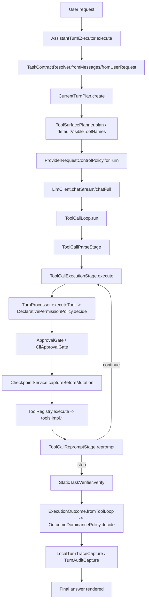
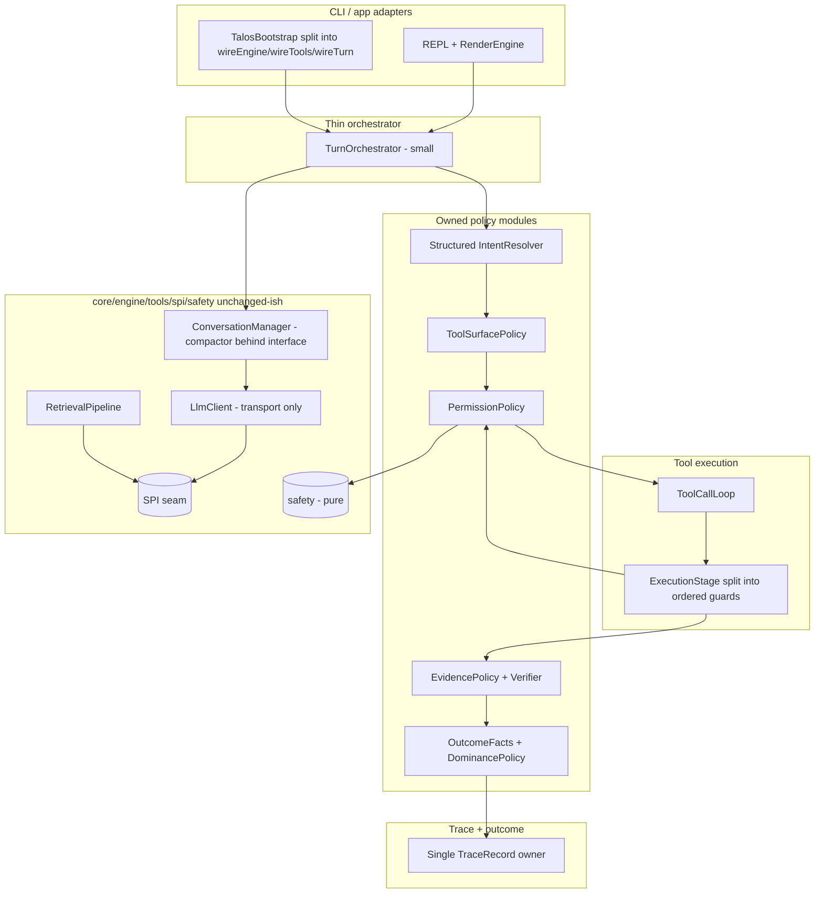

# Talos Current Architecture Design Review

This is a rigorous, evidence-driven architecture audit. It is deliberately blunt. Claims are split
into **hard evidence** (measured via ArchUnit/bytecode, `git`, source reads, line counts) and
**interpretation** (architectural judgment). Where something is unknown, it is marked unknown.

---

## 1. Executive Verdict

**Verdict (blunt):** Talos has a *genuinely coherent architectural intent* — a local-first execution
harness with layered boundaries, approval-gated mutation, evidence/verification discipline, and
first-class traces — and that intent is **partially but unevenly realized in code**. The layering is
real and now bytecode-enforced (11 ArchUnit hard guards pass; `safety` and `spi` have zero outgoing
edges into higher layers). But the orchestration core is **overweight and policy-saturated**:
`AssistantTurnExecutor` (3191 LOC), `TurnProcessor` (1196 LOC), `TaskContractResolver` (1258 LOC),
and `ExecutionOutcome` (644 LOC, a "record" that is actually a policy engine) concentrate too much
decision logic, and intent classification is a large, brittle **lexical/regex protocol**. This is a
solid, defensible beta-stage architecture with clear extraction targets — not a fragile one, and not
a finished one.

**Architecture scorecard (0–10, detail in §27):**

| Dimension | Score |
|---|---|
| Architecture coherence | 7 |
| Maintainability | 5 |
| Testability | 7 |
| Local-trust design | 8 |
| Policy ownership | 5 |
| Tool-surface discipline | 7 |
| Evidence/verification discipline | 7 |
| Traceability | 8 |
| Context architecture | 6 |
| Release readiness | 6 |
| Top-tier comparison readiness | 6 |

**Beta-release risk:** **Moderate.** No layering or trust-boundary defect blocks beta. The risks are
maintainability (god-classes), classifier brittleness (lexical intent matching), and release hygiene
(branch/version drift). None are correctness-fatal; all are churn-and-confidence risks.

**Maintainability risk:** **Elevated.** Four classes over 1000 LOC and a 54-class `runtime.toolcall`
package mean change cost and regression risk are high in exactly the hottest path.

**Top 5 strengths**
1. Enforced layering with zero-leak lower layers (`safety`, `spi` have 0 upward edges) — measured.
2. First-class, redaction-aware trace/evidence subsystem (`LocalTurnTraceCapture`, `JsonSessionStore` via `SafeLogFormatter`).
3. Centralized approval/permission decision in `DeclarativePermissionPolicy` that fails closed.
4. Runtime-owned immutable turn state (`CurrentTurnPlan`, 157 LOC) that exists to stop retry drift.
5. Clean, stateless retrieval pipeline (BM25→KNN→RRF→SourceBoost→Rerank→Dedup) over immutable `StageOutput`.

**Top 5 risks**
1. `AssistantTurnExecutor` is a 3191-LOC god-object orchestrator + policy warehouse.
2. Intent layer (`TaskContractResolver` 1258, `MutationIntent` 418) is a sprawling lexical/regex classifier — brittle and hard to reason about.
3. Policy is spread across 31 classes in `runtime.policy` plus inline logic in orchestrators; ownership is fuzzy.
4. `ExecutionOutcome` (644) and `TurnProcessor.executeTool` (~400-line method) are boolean-flag-saturated god-methods.
5. Release hygiene drift: branch named `v0.9.0-beta-dev` but `talosVersion=0.9.9`, and default remote branch is `main`.

---

## 2. Evidence Base

- **Branch:** `feature/archunit-architecture-guards`
- **Commit:** `ed3d1eb6` (descends from `v0.9.0-beta-dev`)
- **Repo:** `ai21z/talos-cli` (local working dir `loqj-cli`), Java 21, Gradle 8.14 Kotlin DSL, JUnit 5.

**Commands run (this review):**
- `git rev-parse --abbrev-ref HEAD` / `--short HEAD` / `git log --oneline -1` → branch/commit confirmed.
- `.\gradlew.bat test --tests "dev.talos.architecture.*" --no-daemon` → **BUILD SUCCESSFUL** (11 hard guards + 3 report-only tests pass).
- Line-count and package-count enumeration over `src/main/java/dev/talos/**` (PowerShell).
- ServiceLoader / `META-INF/services` enumeration; god-class test-existence checks.

**Reports used (machine-generated, git-ignored, regenerated by the report-only tests):**
- `build/reports/talos/architecture/architecture-discovery-report.md`
- `build/reports/talos/architecture/architecture-cycle-report.md`
- `build/reports/talos/architecture/harness-spine-access-report.md`

**Docs read:** `.github/copilot-instructions.md`, `AGENTS.md`, `README.md`,
`docs/architecture/01-execution-discipline-and-local-trust.md`,
`docs/architecture/11-architecture-guardrails.md`,
`docs/architecture/12-current-architecture-risk-report.md`,
`docs/architecture/13-external-architecture-visualization-plan.md`,
`work-cycle-docs/**` (skim).

**Source areas inspected:** `cli.modes`, `cli.repl`, `cli.approval`, `cli.prompt`, `runtime` (root +
`toolcall`, `policy`, `verification`, `repair`, `task`, `turn`, `trace`, `command`, `outcome`),
`core.context`, `core.llm`, `core.rag`, `core.retrieval`, `core.rerank`, `core.engine`, `tools`,
`tools.impl`, `safety`, `spi`, `engine`, `app`. Hotspot classes were read at method granularity via
targeted subagent passes plus direct verification of critical claims.

**Tests run:** focused architecture suite only (above).

**What was NOT run / NOT done:**
- Full `.\gradlew.bat test` — previously observed to run >24 minutes without completing (backend/integration-dependent); **deliberately not run**. No production code changed, so the full suite is not gating this review.
- No Qodana / coverage / E2E packs were executed for this review.
- No production code was modified. No new ArchUnit guards were added.
- Some `runtime.policy` classes (31 total) and some E2E packs were not read line-by-line; sampled, not exhaustive.

---

## 3. Product and Architecture Identity

Does the implementation match Talos's stated identity? Mostly yes, with caveats.

| Identity claim | Verdict | Evidence |
|---|---|---|
| Local-first | **Matched** | No cloud orchestration; engines are local `llama.cpp`/Ollama via SPI; retrieval/index/cache all local. |
| Bounded workspace tasks | **Matched** | `ProtectedWorkspacePaths.classify()` + `ToolContext.resolve()` confine ops; command cwd rejected if it escapes workspace (`CommandProfileRegistry.resolveCwd`). |
| Explicit user control | **Matched** | Approval gate (`CliApprovalGate`) returns APPROVED / APPROVED_REMEMBER / DENIED; mutation requires approval. |
| Approval-gated writes | **Matched** | `DeclarativePermissionPolicy.decide()` denies protected mutation, asks for protected reads, fails closed. |
| Traceability | **Matched (strong)** | `LocalTurnTraceCapture` is a first-class per-turn record; `TurnProcessor` begins/ends it explicitly. |
| Verification-oriented outcomes | **Matched** | `StaticTaskVerifier` + `ExecutionOutcome` + `OutcomeDominancePolicy` enforce post-apply verification and dominance. |
| Context handling across turns | **Matched** | `ConversationManager` + `ConversationCompactor` sketch-based compaction, `ContextPacker` token budgeting. |
| NOT a swarm | **Matched** | Single orchestrator; no agent spawning. |
| NOT a background daemon | **Matched** | Synchronous REPL/turn model; no autonomous loop. |
| NOT open-ended shell automation | **Matched** | `run_command` is bounded to a fixed `CommandProfileRegistry` (gradle test/check/build/installDist/e2e + a few diagnostics), argv-only, env allowlist, output caps, timeout + process-tree kill. |

**Interpretation:** The trust/identity story is the strongest part of the architecture and is backed
by code, not just docs. The gap is not *identity drift*; it is *internal structure* — the identity is
implemented inside a few very large classes rather than distributed across well-owned policies.

---

## 4. Domain Responsibility Map

**Hard evidence — production class counts (top-level classes; 534 total top-level, 812 incl. inner; ~6170 methods; 2658 deduped class→class edges):**

| Top-level package | Classes | Role |
|---|---:|---|
| `runtime` | 257 | Orchestration, policy, tool-call loop, verification, repair, trace, outcome — the harness brain |
| `cli` | 103 | REPL, launcher, modes (incl. `AssistantTurnExecutor`), prompt-debug, UI rendering, approval gate |
| `core` | 90 | LLM client, context/retrieval/rerank/ingest/index/embed/cache, config, audit, privacy |
| `tools` | 33 | Tool registry, descriptors, file/dir/grep/workspace tool implementations |
| `spi` | 27 | Engine-neutral seam: `ModelEngine`, `ChatMessage`, `ToolSpec`, `EngineException`, DTOs |
| `engine` | 16 | Concrete backends: `llama.cpp`, Ollama, compat HTTP client, `EngineRegistry` |
| `safety` | 5 | Redaction, protected-path classification, safe log formatting |
| `app` | 2 | `Main` (Picocli entrypoint) — composition trigger |
| `api` | 1 | `TalosKnowledgeEngine` programmatic seam |

**Runtime subpackages (hard evidence):** `toolcall` 54, `(root)` 36, `policy` 31, `trace` 28,
`verification` 21, `outcome` 18, `command` 13, `repair` 10, `capability` 9, `expectation` 9,
`workspace` 8, `checkpoint` 6, `context` 4, `failure` 3, `phase` 3, `task` 3, `turn` 1.

**Core subpackages:** `context` 14, `embed` 8, `extract` 8, `ingest` 8, `retrieval` 7, `llm` 7,
`index` 6, `privacy` 4, `util` 4, `rerank` 3, `secret` 2, `security` 2, `cache`/`capability`/`engine`/`net`/`rag` 1 each.

**CLI subpackages:** `repl` 49, `modes` 20, `ui` 13, `launcher` 11, `prompt` 7, `approval` 1.

| Domain | Major classes | Responsibility | Health | Coupling notes | Ownership clarity |
|---|---|---|---|---|---|
| Turn orchestration | `AssistantTurnExecutor`, `TurnProcessor` | Drive the whole turn lifecycle | **Poor** (god-objects) | Highest fan-out (63 each) | Fuzzy — policy embedded inline |
| Tool-call loop | `ToolCallLoop`, `ToolCallExecutionStage`, `ToolCallParseStage`, `ToolCallRepromptStage` | Parse→execute→reprompt iterations | Mixed | `ToolCallLoop` fan-in 45 | Mostly clear, but `ExecutionStage.execute` is a god-method |
| Intent / task contract | `TaskContractResolver`, `MutationIntent` | User text → `TaskContract`, targets | **Poor** (lexical sprawl) | Feeds everything downstream | Scattered across helper policies |
| Runtime policy | `runtime.policy.*` (31) | Action/evidence/permission/path policy | Mixed | Many tiny classes + inline duplicates | Fragmented |
| Verification/repair | `StaticTaskVerifier`, `EvidenceObligationVerifier`, `RepairPolicy` | Post-apply verification, repair plans | Mixed | `StaticTaskVerifier`→`ToolCallLoop` coupling | Spread across helper verifiers |
| Outcome/truthfulness | `ExecutionOutcome`, `OutcomeDominancePolicy` | Final-answer classification & dominance | Mixed | `ExecutionOutcome` is policy-in-a-record | `OutcomeDominancePolicy` is a clean extraction |
| Trace/evidence | `LocalTurnTraceCapture`, `TurnAuditCapture`, `JsonSessionStore` | First-class turn records, redaction | **Good** | Trace↔policy two-way writes | Clear |
| Context/retrieval | `ConversationManager`, `ContextPacker`, `RagService`, `RetrievalPipeline` | History, budgeting, retrieval | Good | `context`↔`llm` cycle | Mostly clear |
| LLM/engine/SPI | `LlmClient`, `EngineRegistry`, `engine.*`, `spi.*` | Model transport, backend selection | Mixed | `LlmClient` 1093 LOC | SPI clean; `LlmClient` overloaded |
| Tools | `ToolRegistry`, `tools.impl.*` | Tool contracts + implementations | Good | Sandbox checks duplicated per tool | Clear contracts |
| Safety | `safety.*` (5) | Redaction, protected paths | **Good (pure)** | 0 outgoing upward edges | Clear |

---

## 5. Layering and Dependency Boundaries

**Layer model (8 layers, low→high):**
`safety` (lowest, 0 out-edges) → `spi` (0 out) → `core` / `engine` / `tools` → `runtime` (high
orchestration) → `cli` (top adapter). `app` = composition root (unconstrained); `api` = programmatic seam.

**Current hard guards (11 total — ArchUnit, `dev.talos.architecture.LayeredArchitectureTest`, all PASS):**

Gen-1 (mirror the hand-rolled `build.gradle.kts` regex ratchet):
1. `runtime` and `core` must not depend on `cli`.
2. `core` must not depend on `runtime`.
3. `tools` must not depend on `runtime`.
4. `engine` must not depend on `runtime`.
5. `safety` must not depend on `app`/`cli`/`core`/`engine`/`runtime`/`spi`/`tools`.
6. `spi` must not depend on `cli`/`core`/`runtime`/`tools`.

Gen-2 (bytecode-only, no regex counterpart — finer-grained):
7. `runtime.policy` must not depend on `cli`.
8. `runtime.verification` must not depend on `cli`.
9. `runtime.toolcall` must not depend on `cli.repl`.
10. `tools` must not depend on `cli` (new boundary).
11. `spi` must not depend on `app` (new boundary).

**Pass/fail:** 11/11 pass. ArchUnit `failOnEmptyShould` is default-true, so each `noClasses().that(<pkg>)`
selector is proven non-empty (non-vacuous) at run time. `e2eTest` classes are excluded structurally:
`e2eTest` is a **separate Gradle source set** (`build.gradle.kts:642-654`) with its own
`classesDirs`/`runtimeClasspath`; the `test` task uses `sourceSets["test"].runtimeClasspath` only, and
`@AnalyzeClasses(importOptions = DoNotIncludeTests.class)` further excludes test code.

**Blind spots:**
- Gen-2 guards (7–11) have **no `build.gradle.kts` regex counterpart**. If someone edits the regex ratchet and forgets ArchUnit (or vice versa), the two enforcement mechanisms can drift. Documented in `11-architecture-guardrails.md`, not yet reconciled.
- `app` and `api` are intentionally unconstrained; nothing checks that `app` stays a thin composition root or that `api` stays a thin seam. `app` is only 2 classes today, so low risk now.
- No guard forbids `core → tools` (which is the one real top-level cycle leak — see §6).

**api/spi/safety ambiguity:** `spi` carries some provider-shaped baggage (`ChatMessage` encodes native
tool-call concepts; `ModelEngineProvider` has a legacy reflection fallback on concrete config types).
It is "clean seam + compatibility baggage," not a pure abstract seam. `safety` is genuinely pure.
`api` (1 class) is under-exercised and its intended contract is thin/unclear.

**Recommended future guards (do NOT add yet — see §26):**
- `core` must not depend on `tools` (would currently FAIL: 8 edges — the real defect).
- `runtime.repair` / `runtime.outcome` must not depend on `cli` (verify edges first).

**Boundaries that should NOT be tightened yet:** `runtime`-internal subpackage cycles (the 16-subpackage
SCC) — forbidding those today would fail the build and force premature refactoring. Keep report-only.

---

## 6. Package Dependency and Cycle Review

**Top-level package dependency map (out-edges, hard evidence):**

| From → To | Edges |
|---|---:|
| `cli → runtime` | 278 |
| `cli → core` | 167 |
| `runtime → tools` | 151 |
| `runtime → spi` | 76 |
| `runtime → core` | 64 |
| `core → spi` | 57 |
| `tools → core` | 38 |
| `core → safety` | 12 |
| `core → tools` | **8 (leak)** |
| `safety → *` | 0 |
| `spi → *` | 0 |

**Cycles found:**
- **Top-level:** exactly one — `core ↔ tools`. `tools → core` (38) is *allowed/expected* (tools use core types). `core → tools` (8) is the **defect**: core should not reach up into tools. This is the single highest-value boundary to drive to zero.
- **Runtime subpackages:** one large strongly-connected component spanning ~16 subpackages (policy, toolcall, verification, repair, outcome, task, turn, trace, command, …). This is internal orchestration cohesion, not a layer violation, but it makes subpackage extraction hard.
- **CLI subpackages:** `modes ↔ prompt ↔ repl` cycle.
- **Core subpackages:** `context ↔ llm` (compaction needs `LlmClient`, `LlmClient` needs `TokenBudget`), `rerank ↔ retrieval` (`RerankerStage`→`rerank`, `NoOpReranker`→`RetrievalCandidate`), `extract ↔ privacy`, `(root) ↔ security`.

**Interpretation:** Lower layers are clean (`safety`/`spi` = 0 out). The damaging cycle is `core→tools`
(8 edges). The `context↔llm` and `rerank↔retrieval` cycles are small, real, and fixable by moving a
candidate/abstraction type. The runtime SCC is the structural reason `AssistantTurnExecutor` and
`TurnProcessor` are hard to decompose: everything in the harness references everything else.

---

## 7. Execution Harness Spine

End-to-end flow (classes and key methods):

**Spine fan-out / fan-in (hard evidence):**

| Class | Fan-out | Fan-in | Read |
|---|---:|---:|---|
| `AssistantTurnExecutor` | 63 | 5 | Orchestration hub / god-object |
| `TurnProcessor` | 63 | (high) | Tool-execution + policy hub / god-object |
| `ToolCallLoop` | 22 | 45 | Loop engine; high fan-in (correct) |
| `ToolCallExecutionStage` | 34 | low | God-method `execute()` |
| `StaticTaskVerifier` | 20 | 8 | Verifier orchestrator |
| `ExecutionOutcome` | 30 | 2 | Policy-in-a-record |
| `LocalTurnTraceCapture` | 31 | 21 | Trace hub |
| `ToolSurfacePlanner` | 12 | 2 | Surface policy |
| `CurrentTurnPlan` | 9 | 18 | Immutable turn state (good) |
| `TaskContractResolver` | 8 | 24 | Intent classifier (high fan-in) |
| `EvidenceObligationVerifier` | 5 | 5 | Well-contained |
| `ConversationManager` | 5 | 9 | Context boundary |

**Interpretation:** The spine is *recognizable and correctly ordered* — inspect→plan→surface→approve→
execute→verify→outcome→trace. The defect is that two nodes (`AssistantTurnExecutor`, `TurnProcessor`)
absorb decisions that belong in the smaller, already-existing policy classes around them.

---

## 8. CurrentTurnPlan and Runtime-Owned Turn State

- **Does the runtime own the turn?** Largely yes. `CurrentTurnPlan` (`runtime.turn`, 157 LOC) is an
  immutable record snapshotting contract, derived phase, tool surfaces, obligations, expectations,
  and task context. Its canonical constructor derives defaults and copies lists immutably.
- **Frozen facts:** task contract, `ExecutionPhase`, visible/native tool surfaces, `ActionObligation`
  (via `ActionObligationPolicy.derive`), `EvidenceObligation` (via `EvidenceObligationPolicy.derive`),
  expectations (via `TaskExpectationResolver.resolve`), workspace path.
- **Retry/history drift risk:** **Real but contained.** `CurrentTurnPlan` exists precisely to prevent
  retry drift, but it offers both `create(...)` factories and a `compatibility(...)` adapter, and
  derivation logic lives in the constructor. If a caller mixes a frozen plan with a re-derivation from
  messages mid-turn, facts can diverge. The class is the right boundary; the derivation rules need a
  single explicit owner.
- **Where more immutability/lifecycle clarity is needed:** make `CurrentTurnPlan` the *only* source of
  per-turn facts for the rest of the spine (no re-deriving phase/obligations downstream); collapse the
  `create` overloads + `compatibility` adapter once callers are migrated.

**Verdict:** One of the better-designed pieces. Keep, document, and make it authoritative.

---

## 9. Intent and Task Contract Layer

**Hard evidence:** `TaskContractResolver` = 1258 LOC, 5 public methods, ~13 marker sets +
~20 regexes; `MutationIntent` = 418 LOC, ~18 `REQUEST_PATTERNS` + 23 `MARKERS` + 28
`READ_ONLY_NEGATIONS` + ~15 more regexes.

- **Classification reasons:** A `classificationReason` string is computed and then consumed downstream
  by `ActionObligationPolicy`, `ProviderRequestControlPolicy`, etc. — i.e., **string-typed control
  flow** crossing class boundaries.
- **Lexical marker load:** Very high. Intent is recognized by phrase lists and regexes:
  `CREATE_MARKERS`, `DIAGNOSE_MARKERS`, `WORKSPACE_MARKERS`, `NO_INSPECTION_MARKERS`,
  `DEICTIC_FOLLOW_UPS`, `CHAT_ONLY_HINTS`, etc. This is the classic "stringly-typed protocol" smell.
- **Conversation boundary handling:** delegated to `ConversationBoundaryPolicy` (small talk / no-workspace privacy) — a reasonable extraction.
- **Deictic follow-up handling:** `DEICTIC_FOLLOW_UPS` marker set handles "do it", "that one" — fragile to phrasing.
- **Natural mutation phrasing:** `MutationIntent` tries to map "summarize X into Y", "build from source to targets", etc., via overlapping regexes — high false-positive/negative risk.
- **Risks:** brittleness, silent misclassification, overlapping heuristics, no single truth table, and
  difficulty testing the combinatorial space. This is the **#2 maintainability risk** after `AssistantTurnExecutor`.
- **Improvement path:** introduce a structured intent model (enum/sealed `Intent` + typed `Target`
  extraction) with the lexical layer as one *replaceable* feature extractor feeding a deterministic
  decision table; add golden-corpus tests of phrase→contract. Do not rewrite in one pass.

---

## 10. Tool Surface and Capability Control

- `ToolSurfacePlanner` (319 LOC, utility class) derives the per-turn tool surface from task contract +
  phase + tool metadata. `plan(...)` builds native specs; `defaultVisibleToolNames(...)` builds the
  visible list. Surface selection is **centralized**, not ad hoc — good.
- **Native tool specs / prompt surface:** `plan()` converts to provider specs; `ProviderRequestControlPolicy.forTurn` then translates obligations + visible tools into engine-neutral `ChatRequestControls`.
- **Least-capability behavior:** read-only turns get read/list/grep/retrieve; mutation/command surfaces are added only when the contract requires them. This is real least-capability narrowing.
- **`run_command` isolation:** strong. `RunCommandTool` → fixed `CommandProfileRegistry` (gradle test/check/build/installDist/e2e + diagnostics), `CommandArgumentPolicy.validate` argv gate, cwd confined to workspace, env allowlist, output byte caps + redaction, timeout + process-tree kill (`ProcessCommandRunner`).
- **Read-only vs mutation vs verification surfaces:** distinguished via `ToolOperationMetadata` (capability/risk/path roles/approval/checkpoint flags).
- **Risks/improvements:** `ToolSurfacePlanner` embeds regex path inference (`SLASH_PATH_CANDIDATE`, `FILE_EXTENSION`) and many `classificationReason` string checks — same stringly-typed smell, smaller scale. Tool surface decisions partly depend on upstream classifier strings; tightening the intent model (§9) would simplify this too.

---

## 11. Approval, Permission, Protected Resource, and Safety Boundaries

- **Approval decision is centralized** in `DeclarativePermissionPolicy.decide()` (allow/ask/deny): denies workspace escapes, denies protected mutations, asks for protected reads, falls back to session policy then default-ask. **Fails closed.**
- **Approval is split across three concepts** (a smell): tool metadata `requiresApproval` (`ToolOperationMetadata`), session `ApprovalPolicy` (AUTO_APPROVE/ASK/DENY), and the UI `ApprovalGate`/`CliApprovalGate` (APPROVED/APPROVED_REMEMBER/DENIED). `TurnProcessor` is the seam that invokes policy then gate.
- **Protected path policy:** `ProtectedWorkspacePaths.classify()` is the real classifier; `ProtectedPathPolicy` wraps it for policy use; `ProtectedPathAliasNormalizer` canonicalizes escaped dotfile aliases.
- **Protected read/write:** protected reads → ask; protected writes → deny (pre-approval). Good.
- **Path canonicalization:** `PathArgumentCanonicalizer` + `ToolContext.resolve()` normalize but explicitly **do not** enforce sandbox — they document that the caller must check. Enforcement lives in the policy layer *and* is duplicated in each tool.
- **Workspace boundary:** `ProtectedWorkspacePaths` + per-tool `ctx.sandbox().allowedPath(...)` checks (`ReadFileTool`, `FileWriteTool`, `FileEditTool`, `ListDirTool`, `WorkspaceOperationToolSupport`). **Duplicated** across tools — see §12 smell.
- **Bounded command profiles:** see §10 — well-bounded.
- **Redaction:** `safety.ProtectedContentSanitizer` (text/map scrub + canary/secret detection), `SafeLogFormatter`, `PromptDebugRedactor`. Centralized and used by `JsonSessionStore` and prompt-debug.
- **Is the safety layer low and pure?** **Yes.** All 5 `safety` classes depend only on JDK types; 0 upward edges (ArchUnit-enforced). This is the cleanest part of the codebase.

**Interpretation:** Trust boundaries are correctly designed and fail closed. The one structural weakness
is **enforcement duplication**: sandbox/path checks live both in `DeclarativePermissionPolicy` and in
every mutating tool. That is defense-in-depth today but a divergence risk tomorrow.

---

## 12. Tool Execution and Workspace Operations

- `ToolCallLoop` (357 LOC) — parse→execute→reprompt iteration engine; injected `TurnProcessor`,
  `maxIterations`, `ToolProgressSink`, `strict`. Constructs stages directly inside `run()`. Fan-in 45
  (correct: it is the shared loop). **Acceptable orchestration**; the growing `LoopResult` metrics
  record is worth watching.
- `ToolCallExecutionStage` (461 LOC) — **god-method `execute()` (~lines 88–409)**: pre-approval guards,
  evidence guards, mutation accounting, approvals, checkpointing, tool execution, outcome recording, in
  strict order. ~14 collaborators (guards, accounting, factories, handoff). **Strong split candidate.**
  **It has no dedicated unit test** (verified) — a real gap for the second-hottest method in the harness.
- `TurnProcessor` (1196 LOC) — `process()` (turn dispatch + audit lifecycle) and `executeTool()`
  (~400-line policy pipeline: normalization → validation → surface gating → approval → checkpoint →
  execution). Many `isXTool(...)` string classifiers. **God-object** with the largest collaborator set
  in `runtime`. Has 8 dedicated test files (good coverage despite size).
- **Workspace operation tools:** move/copy/delete/mkdir via shared `WorkspaceOperationToolSupport.resolveAllowed()` — good consolidation.
- **Tool metadata / registry:** `ToolRegistry` is a clean name→instance map (`register/get/descriptors/execute`); `ToolDescriptor` + `ToolOperationMetadata` are immutable. Registration is **manual** in `TalosBootstrap` (no discovery) — fine at 33 tools, mild bootstrap sprawl.
- **Stringly-typed protocol:** `ToolCall` params are `Map<String,String>`; tools manually alias params (`resolveParam(...)`). Repetitive and error-prone.

**Where cohesive:** `ToolRegistry`, `ToolDescriptor`, workspace-op support, `ToolCallLoop` skeleton.
**Where risky:** `ToolCallExecutionStage.execute` and `TurnProcessor.executeTool` — both god-methods with
ordered, flag-driven branches.

---

## 13. Evidence Obligations and Verification

- `EvidenceObligationPolicy` (127 LOC) — derives evidence obligations from contract/phase/workspace; ordered if-chain (unsupported-doc target, protected target, mutationAllowed, static-web). Clean-ish.
- `EvidenceObligationVerifier` (461 LOC) — well-contained per fan metrics (5/5); checks obligations are met. Larger than ideal but isolated.
- `StaticTaskVerifier` (565 LOC) — post-apply verifier orchestrator: mutation readback, web coherence, selectors, imports, exact edits, source-derived artifacts. Delegates to ~8 helper verifiers (`MutationTargetReadbackVerifier`, `ExactEditReplacementVerifier`, `StaticWebPartialVerifier`, etc.). **Couples directly to `ToolCallLoop.LoopResult`/`ToolOutcome`** (`import dev.talos.runtime.ToolCallLoop`) — verification depends on the loop's data model.
- **WorkspaceOperation verification / exact-literal verification / static web diagnostics:** present as dedicated helper verifiers — good separation at the helper level.
- **Unsupported document honesty:** enforced via obligation + `UnsupportedDocumentAnswerGuard` in the outcome layer.
- **Evidence dominance:** `ExecutionOutcome` + `OutcomeDominancePolicy` ensure verification/evidence facts dominate model prose (see §14).
- **Gaps:** `StaticTaskVerifier`↔`ToolCallLoop` coupling means the verifier cannot be reused outside the loop's data shape; extract a neutral verification input record. Verifier is an orchestrator god-class trending the way of the others.

---

## 14. Outcome and Truthfulness Layer

- `ExecutionOutcome` (644 LOC) — **a `record` that is actually a policy engine.** `fromToolLoop(...)`
  (~lines 102–445) and `fromNoTool(...)` (~447–609) classify the final answer using a large set of
  booleans (`invalidMutation`, `partialMutation`, `falseMutationClaim`, …) and many answer-guard/renderer collaborators (~30 fan-out).
- `OutcomeDominancePolicy` (224 LOC) — **clean extraction**: pure `decide(Facts) → Decision` dominance
  table mapping boolean evidence to completion/task status. This is the *right* shape; the problem is
  that `ExecutionOutcome` still owns the boolean *computation* and the rendering.
- **Truth warnings / blocked/partial/complete semantics:** encoded in `TaskCompletionStatus` + dominance decision; renderers (`MutationFailureAnswerRenderer`, `StaticVerificationAnswerRenderer`, etc.) shape user-facing text.
- **Can model prose override runtime facts?** Architecturally **no** — dominance policy is computed from runtime evidence and applied after the model answer, and guards (`EvidenceContainmentAnswerGuard`, `ProtectedReadAnswerGuard`) can replace prose. This is the strongest truthfulness control. (Whether it holds under every phrasing is a live-audit question, not a static one.)
- **Risks:** `ExecutionOutcome` mixes fact computation + dominance + rendering. Extract fact-collection into a `OutcomeFacts` builder and keep `OutcomeDominancePolicy` as the only decision-maker; let renderers consume the decision.

---

## 15. Traceability and Prompt Debugging

- `LocalTurnTraceCapture` (413 LOC, fan 31/21) — **first-class per-turn record**: trace id/session/turn,
  policy trace, model response, tool parsing, approvals, command policy, permissions, checkpoints,
  context-ledger hookup. `TurnProcessor` begins/ends it explicitly and attaches it to `TurnAudit`.
- `TurnAuditCapture` — thin thread-local bag of per-turn audit facts; `recordToolCall()` writes synthetic events straight into `LocalTurnTraceCapture` (**two-way coupling** between the two capture classes).
- **Prompt debug:** `PromptDebugInspector` + `PromptDebugRedactor` (strips protected tool results / provider JSON). `/last trace` and `/prompt-debug` surfaces exist.
- **Trace redaction:** real and centralized via `SafeLogFormatter` + `PromptDebugRedactor`; `JsonSessionStore` writes redacted.
- **Usefulness:** high for both users (`/last trace`) and developers (prompt-debug artifacts, provider bodies).
- **Gaps:** trace is captured partly via thread-local + two coupled capture classes; the `TurnAuditCapture`↔`LocalTurnTraceCapture` write-through is implicit temporal coupling. Consolidate into one trace-record owner with explicit event recording; keep thread-local only at the seam.

---

## 16. Context Handling and Retrieval

- `ConversationManager` (294 LOC) — history + compaction boundary; holds `ConversationMemory`,
  `TokenBudget`, `volatile String sketch`. Packs token-bounded history, prepends sketch as a system
  message, triggers `maybeCompact(LlmClient)`. **Not a pure boundary**: depends on `core.llm.LlmClient` (the `context↔llm` cycle).
- `ConversationCompactor` — explicitly stateless; returns a sketch; takes `LlmClient` as a parameter.
- `ContextPacker` — token budgeting (chars/4 heuristic, response+overhead reservation), pinned-snippet priority + 2-file reservation, sanitize/dedup/truncate, citation metadata.
- **Retrieval pipeline:** `RagService.prepare()` → `RetrievalPipeline.execute()` with stages
  **BM25 → KNN → RRF Fusion → SourceBoost → Rerank → Dedup**; stages are stateless over immutable
  `StageOutput`. `RerankerStage`↔`rerank` package creates a small `rerank↔retrieval` cycle.
- **Pinned snippets / compact sketches / token budgeting:** all present and reasonably designed.
- **Relation to local trust and repair:** retrieval results feed model context; protected/unsupported files are excluded from indexing by policy (per docs); repair uses static-verifier facts, not retrieval.
- **Improvements:** break `context↔llm` by injecting the compactor behind an interface so `ConversationManager` doesn't import `LlmClient` directly; move the reranker candidate type to a neutral package to break `rerank↔retrieval`.

---

## 17. LLM Engine / SPI / Adapter Architecture

- `LlmClient` (1093 LOC) — large transport + budgeting + streaming/buffered fallback + tool-spec wiring. Imports `core.context.TokenBudget` (the other half of the `context↔llm` cycle). **Overloaded**; a clear shrink target.
- **Engine resolver / selection:** `EngineRegistry` uses `ServiceLoader.load(ModelEngineProvider.class)` (the **only** production ServiceLoader site, `core.engine.EngineRegistry:38`) and owns discovery + catalog union + backend/model selection + lifecycle. `RegistryLlmEngineResolver` wraps it.
- **Compat clients:** `engine.compat.CompatChatClient` is a direct HTTP adapter for chat-completions-style servers; `engine.llamacpp.*` (8) and `engine.ollama.*` (6) are concrete backends.
- **ServiceLoader registration:** 2 `META-INF/services` files exist
  (`dev.talos.spi.ModelCatalog`, `dev.talos.spi.ModelEngineProvider`) — provider registration **is** in
  checked-in sources (correcting an earlier "none found" observation).
- **Backend runtime config:** managed `llama.cpp` preferred, Ollama legacy.
- **Is SPI clean enough?** Mostly. `spi` has 0 upward edges; interfaces + records + sealed
  `EngineException`. `ToolSpec` lives in SPI to avoid depending on tool impls — good. Baggage:
  `ModelEngineProvider` legacy reflection fallback; `ChatMessage` encodes native tool-call concepts.
- **Do engines know too much?** `EngineRegistry` conflates discovery + selection + lifecycle. Extract
  discovery from selection; keep `ServiceLoader` at the edge.

---

## 18. DI, Composition, and Test Seams

**Framework-free by design (no Spring/Guice/Dagger) — and that is correct here.**

- **Composition root:** `cli.repl.TalosBootstrap` (607 LOC, fan-out 88 — the highest in the codebase, *as a composition root should be*). It wires `Audit`, `Redactor`, `Sandbox`, `RagService`, `LlmClient`, `NetPolicy`, `SessionMemory`, `ToolRegistry`, `ConversationManager`, `JsonSessionStore`/`NoOpSessionStore`, `RenderEngine`, `CliApprovalGate`, `Session`, `SessionApprovalPolicy`, `CheckpointService`, `TurnProcessor`, `ToolCallLoop`. `app.Main` is a minimal Picocli entrypoint.
- **Constructor injection:** dominant for runtime collaborators (`TurnProcessor`, `ToolCallLoop`, stages).
- **Static factories:** `CurrentTurnPlan.create`, `ExecutionOutcome.fromToolLoop`, `CommandProfileRegistry.defaultRegistry`.
- **Registries:** `ToolRegistry` (manual), `EngineRegistry` (ServiceLoader), `CommandProfileRegistry`.
- **Service loaders:** exactly 1 production site (`EngineRegistry`).
- **Function/callback injection:** `LlmClient.setCancelSupplier/setToolSpecs`, `CliApprovalGate(Function<…>)`, `ToolProgressSink render::printToolProgress`, `ToolCallStreamFilter(renderRef.answerStreamSink(...))`. Healthy use of small function seams.
- **Test seams:** good where deps are injected (`TurnProcessor`, `SessionStore` interface, `Config(Path)` ctor); weak where static/process-local state is used.
- **Static utility risk (hidden global state):** `core.CfgUtil` (all-static parse/merge/env), `core.Config` (mutable global-ish config + static env keys), `core.Audit` (process-wide mutable logging + filesystem side effects). These are the framework-free DI's soft spots — they couple invisibly and are hard to isolate in tests.
- **Direct-construction hotspots:** `TalosBootstrap` (acceptable — it's the root) and stage construction inside `ToolCallLoop.run()` (acceptable). Concerning: scattered `new` of policy collaborators inside orchestrators that could be injected for testing.
- **Recommended composition-root shape:** keep one explicit root, but split `TalosBootstrap` into small `wireX()` factory methods/objects (engine wiring, tool wiring, turn wiring) to reduce its 607-LOC/88-fan-out bulk. Convert `Audit`/`Config` static state to injected instances behind interfaces over time.
- **Is framework-free DI working?** **Yes.** No DI framework is warranted. The evidence (explicit constructor injection + small callbacks + one ServiceLoader at the SPI edge) shows the approach is sufficient. The fix is discipline (shrink statics, split the root), not a framework.

---

## 19. Testing, E2E, Manual QA, and Work-Test Cycle

**Hard evidence:** 423 unit test files (`src/test/java`), 29 E2E test files (`src/e2eTest`),
4 architecture test classes (11 hard guards + 3 report-only).

- **Unit tests:** broad. Hotspots have dedicated tests — `AssistantTurnExecutor` (5 test files incl. phase-policy, mutation-request, native-tool-surface), `TurnProcessor` (8 files: checkpoint, command-policy, denial-wording, permission, phase, placeholder-guard, scope-guard), `TaskContractResolver`, `ExecutionOutcome`, `StaticTaskVerifier`, `RepairPolicy`. **Gap:** `ToolCallExecutionStage` has **no direct test** despite being a 461-LOC god-method.
- **Architecture tests:** ArchUnit guards + report-only discovery/cycle/spine tests. Tests now protect **architecture**, not only behavior — a real maturity signal.
- **E2E scenario packs:** `Phase0ScenariosTest` (write/overwrite/read-edit/denial/unknown-tool/missing-path/grep/list_dir/multi-tool), `PersistenceScenarioPackTest` (turn-log fallback, snapshot consistency). `ScenarioRunner` provides a workspace fixture + scripted LLM + approval policy + `ToolCallLoop` harness with optional persistence replay.
- **Manual QA / failure intake:** `work-cycle-docs/**` (work-test cycle, setup, step-by-step, milestone + full-E2E audit workflows, tickets). Mature process discipline.
- **TalosBench / failure intake:** present in work-cycle docs; not exercised here.
- **Do tests protect architecture or only behavior?** **Both**, now that ArchUnit exists.
- **What is missing:** a direct `ToolCallExecutionStage` test; a golden-corpus test for intent classification (`TaskContractResolver`/`MutationIntent`) to pin the lexical protocol; a regression test asserting `core→tools` edges trend to zero.

---

## 20. Hotspot Class Review

| Class | LOC | Fan-out/in | Role | Key methods | Collaborators | Risk | Recommendation |
|---|---:|---|---|---|---|---|---|
| `AssistantTurnExecutor` | 3191 | 63/5 | Turn orchestrator + policy warehouse | `execute`, `resolveToolLoopAnswer`, `resolveNoToolAnswer`, `buildCurrentTurnPlan`, `injectTaskContractInstruction` | `TurnProcessor`, `ToolCallLoop`, `CurrentTurnPlan`, `TaskContractResolver`, `ToolSurfacePlanner`, `RepairPolicy`, `StaticTaskVerifier`, `LocalTurnTraceCapture` | **Critical** god-object | Split into orchestrator + extracted policies/renderers |
| `TurnProcessor` | 1196 | 63/high | Tool-execution + approval/policy hub | `process`, `executeTool`, `validateBeforeApproval`, `captureCheckpointBeforeMutation` | `TurnRouter`, `ApprovalGate`, `PermissionPolicy`, `CheckpointService`, `ToolRegistry`, many guards | **Critical** god-object | Extract `executeTool` pipeline into ordered stages |
| `TaskContractResolver` | 1258 | 8/24 | Intent/target classifier | `fromMessages`, `fromUserRequest`, `extractExpectedTargets`, `extractForbiddenTargets` | `MutationIntent`, `CapabilityAnswerPolicy`, `ConversationBoundaryPolicy`, `StaticWebImportIntent` | **High** lexical sprawl | Structured intent model + golden tests |
| `LlmClient` | 1093 | high | Model transport + budgeting + streaming | chat/stream/budget methods | `TokenBudget`, engine resolver, `ToolSpec` | **High** | Split transport from budgeting; break `context↔llm` |
| `RepairPolicy` | 747 | — | Repair-plan builder from verifier failures | `planForStaticVerification`, `enrichSelectorFactsForRepairContext`, `emptyEditRepairInstruction` | `StaticTaskVerifier`, `StaticWebCapabilityProfile`, `LoopState` | **High** (prompt parsing in policy) | Extract instruction-template + fact-parsing |
| `ExecutionOutcome` | 644 | 30/2 | Final-answer classification "record" | `fromToolLoop`, `fromNoTool`, `outcomeDecision` | `OutcomeDominancePolicy`, many guards/renderers | **High** policy-in-record | Extract `OutcomeFacts` builder; renderers consume decision |
| `StaticTaskVerifier` | 565 | 20/8 | Post-apply verifier orchestrator | `verify`, `verifyInternal` | ~8 helper verifiers; `ToolCallLoop.LoopResult` | **Medium-High** (loop coupling) | Neutral verification-input record; keep helpers |
| `EvidenceObligationVerifier` | 461 | 5/5 | Evidence-obligation checker | obligation checks | obligation/contract types | **Medium** | Keep; monitor size |
| `ToolCallExecutionStage` | 461 | 34/low | One-iteration executor (god-method) | `execute` (~88–409) | ~14 guards/accounting/factories | **High** + **no test** | Split `execute` into ordered guard stages; add tests |
| `MutationIntent` | 418 | — | Mutation-intent lexical classifier | `classificationReason`, `sourceToTargetArtifact` | `ToolCallSupport` | **High** brittleness | Fold into structured intent model |
| `LocalTurnTraceCapture` | 413 | 31/21 | First-class trace record | event recorders | `TurnProcessor`, `TurnAuditCapture`, `JsonSessionStore` | **Medium** (two-way capture coupling) | Consolidate trace ownership |
| `ToolCallLoop` | 357 | 22/45 | Parse→execute→reprompt engine | `run` | stages, `ToolCallSupport` | **Medium** (acceptable) | Keep; watch `LoopResult` growth |
| `ToolSurfacePlanner` | 319 | 12/2 | Per-turn tool surface | `plan`, `defaultVisibleToolNames` | `ToolRegistry`, `TaskExpectationResolver` | **Medium** (regex inference) | Document; depends on intent cleanup |
| `ConversationManager` | 294 | 5/9 | History + compaction boundary | `pack`, `maybeCompact` | `LlmClient`, `ConversationCompactor`, `TokenBudget` | **Medium** (`context↔llm`) | Inject compactor behind interface |
| `CurrentTurnPlan` | 157 | 9/18 | Immutable turn state | canonical ctor, `create`, `defaultPhaseFor` | contract/obligation/expectation types | **Low** (good) | Make authoritative; collapse overloads |
| `OutcomeDominancePolicy` | 224 | — | Pure dominance table | `decide(Facts)` | status/contract types | **Low** (good) | Keep; simplify `Facts` later |
| `ToolCallRepromptStage` | 95 | 18/1 | Reprompt decision dispatch | `reprompt`, `hitIterationLimit` | several reprompt gates | **Low** | Document policy chain |

**Biggest hubs:** `TalosBootstrap` (88, expected), `AssistantTurnExecutor` (63), `TurnProcessor` (63).
**God-object risks:** `AssistantTurnExecutor`, `TurnProcessor`, `ToolCallExecutionStage.execute`, `ExecutionOutcome`.
**Well-contained:** `CurrentTurnPlan`, `OutcomeDominancePolicy`, `ToolCallRepromptStage`, `EvidenceObligationVerifier`.

---

## 21. Design Pattern Inventory

| Pattern | Where | Intentional? | Health | Risks | Recommendation |
|---|---|---|---|---|---|
| Pipeline / Chain | `RetrievalPipeline` (stages), `ToolCallLoop` (parse→exec→reprompt) | Intentional | Good (retrieval) / Mixed (loop) | Loop stages constructed inline | Keep; inject loop stages for tests |
| Strategy | `Reranker` (`NoOpReranker`), `ModelEngine` backends, approval gates | Intentional | Good | `rerank↔retrieval` cycle | Move candidate type to neutral pkg |
| Registry / Plugin | `ToolRegistry` (manual), `EngineRegistry` (ServiceLoader), `CommandProfileRegistry` | Intentional | Good | Manual tool registration sprawl in bootstrap | Optional discovery later |
| Policy object | `OutcomeDominancePolicy`, `ActionObligationPolicy`, `EvidenceObligationPolicy`, `DeclarativePermissionPolicy` | Intentional | Mixed | 31-class `runtime.policy` + inline policy in orchestrators | Consolidate ownership |
| Immutable value / Record | `CurrentTurnPlan`, `StageOutput`, `ToolCall`, `ToolResult`, SPI DTOs | Intentional | Good | `ExecutionOutcome` abuses record for logic | Keep records dumb |
| Composition root | `TalosBootstrap` | Intentional | OK | 607 LOC / 88 fan-out | Split into `wireX()` units |
| Facade | `RagService`, `ToolCallSupport` | Intentional | Good | `ToolCallSupport` fan-in 52 (utility magnet) | Watch growth |
| Thread-local context | `TurnAuditCapture`, capture classes | Intentional | Mixed | Hidden global state, two-way coupling | Make explicit owner |
| God-object (anti-pattern) | `AssistantTurnExecutor`, `TurnProcessor` | **Accidental** | Bad | Change cost, regression risk | Staged extraction |
| Stringly-typed protocol (anti-pattern) | `TaskContractResolver`, `MutationIntent`, `isXTool` checks, `ToolCall` Map<String,String> | **Accidental** | Bad | Brittle, untyped control flow | Structured intent + typed params |
| Static utility / hidden global (anti-pattern) | `CfgUtil`, `Config`, `Audit` | Partly accidental | Mixed | Test isolation, invisible coupling | Inject behind interfaces |

---

## 22. Pain Points and Root Causes

- **Policy spread (root cause: no single policy ownership map).** 31 classes in `runtime.policy` plus inline policy inside `AssistantTurnExecutor`/`TurnProcessor`/`ExecutionOutcome`. Decisions are duplicated (e.g., sandbox checks in policy *and* every tool). Symptom: hard to answer "where is this decided?".
- **Orchestration overload (root cause: spine nodes absorb policy).** `AssistantTurnExecutor`/`TurnProcessor` grew to own everything because the runtime SCC makes everything reachable from everything.
- **Lexical classifier growth (root cause: intent modeled as phrases, not structure).** `TaskContractResolver`/`MutationIntent` accreted markers/regexes with no structured intent type or golden corpus.
- **Context complexity (root cause: bidirectional context/llm dependency).** Compaction needs the LLM; the LLM needs the budget; result is a cycle and a not-pure `ConversationManager`.
- **Verification complexity (root cause: verifier tied to loop data model).** `StaticTaskVerifier` imports `ToolCallLoop` types, so verification can't be reused or tested independently of the loop.
- **Trace complexity (root cause: two coupled capture classes + thread-local).** `TurnAuditCapture` writes through into `LocalTurnTraceCapture`.
- **DI/composition weakness (root cause: static global state).** `Config`/`Audit`/`CfgUtil` statics undercut otherwise-clean constructor injection.
- **Testing/reporting gaps (root cause: hottest method untested).** `ToolCallExecutionStage` has no direct test; no intent golden corpus; gen-2 guards lack a regex counterpart.
- **Release/public-surface risk (root cause: branch/version drift).** Branch `v0.9.0-beta-dev` vs `talosVersion=0.9.9`; default remote branch `main`; ArchUnit is quality tooling that per governance needs a standalone approved PR into dev.

---

## 23. Proposed Target Architecture

**No big-bang rewrite.** Staged extraction that preserves behavior and the trust boundary.

Direction: smaller orchestrator; policy modules with single owners; `CurrentTurnPlan` authoritative;
explicit `ToolSurfacePolicy`; verification/outcome dominance preserved; trace as one first-class record
owner; `ConversationManager` boundary cleaned (compactor behind interface); tool/engine adapters isolated
(break `core→tools`, `context↔llm`, `rerank↔retrieval`).

---

## 24. Refactor Roadmap

**NOW (safe, high-value, mostly test/seam work):**
- **Add `ToolCallExecutionStage` unit tests** — affected: `ToolCallExecutionStage`; reason: hottest untested god-method; risk if ignored: silent regressions in approval/checkpoint ordering; benefit: safety net before any split; tests: new `ToolCallExecutionStageTest`; beta-blocking: no (but recommended pre-beta).
- **Add intent golden-corpus tests** — `TaskContractResolver`/`MutationIntent`; pins lexical behavior before refactor; risk: misclassification regressions; beta-blocking: no.
- **Document gen-2 guard / regex drift** (done partially in `11-…`); reconcile or note explicitly; beta-blocking: no.

**NEXT (staged extraction, behavior-preserving):**
- **Extract `OutcomeFacts` from `ExecutionOutcome`** — keep `OutcomeDominancePolicy` as sole decider; renderers consume decision; tests: `ExecutionOutcomeTest` extended; beta-blocking: no.
- **Split `TurnProcessor.executeTool` into ordered guard stages** — reuse existing guards; beta-blocking: no.
- **Break `core→tools` (8 edges)** — move offending core references to neutral types; then consider a hard guard; beta-blocking: no.
- **Break `context↔llm`** — inject compactor behind interface so `ConversationManager` drops the `LlmClient` import.

**LATER (larger, riskier):**
- **Decompose `AssistantTurnExecutor`** into orchestrator + extracted policy/renderer modules — biggest payoff, biggest risk; do after NEXT items reduce coupling.
- **Structured intent model** replacing lexical sprawl, with the marker layer as a replaceable extractor.
- **Decouple `StaticTaskVerifier` from `ToolCallLoop`** via a neutral verification-input record.
- **Convert `Config`/`Audit` static state to injected instances.**

**DO NOT DO YET:**
- Forbid runtime-internal subpackage cycles (would fail build; premature).
- Introduce a DI framework (unjustified — framework-free DI is working).
- Tighten `app`/`api` boundaries (too small to matter now).
- Merge ArchUnit/quality tooling to `v0.9.0-beta-dev`/`main` without the required standalone approved PR.

---

## 25. Proposed Tickets

> IDs are placeholders. "Risk of overreach" is included per the brief.

1. **TAL-ARCH-01 — Unit-test `ToolCallExecutionStage.execute`** | P1 | Problem: 461-LOC god-method, no direct test. Change: add ordered-guard scenario tests (pre-approval block, evidence guard, mutation accounting, checkpoint, execution, failure). Files: `runtime/toolcall/ToolCallExecutionStage*`, new test. Acceptance: branch coverage of major guard paths; all pass. Evidence: focused test run. Overreach risk: low (test-only).
2. **TAL-ARCH-02 — Intent golden corpus** | P1 | Problem: lexical classifier untested at corpus scale. Change: table-driven phrase→`TaskContract` tests. Files: `runtime/task/*`, `runtime/MutationIntent`, new test. Acceptance: documented expected classifications pass. Overreach risk: low.
3. **TAL-ARCH-03 — Extract `OutcomeFacts` from `ExecutionOutcome`** | P2 | Problem: record holds policy + rendering. Change: fact-builder → `OutcomeDominancePolicy.decide` → renderers. Files: `cli/modes/ExecutionOutcome`, `OutcomeDominancePolicy`. Acceptance: identical outcomes on existing tests. Overreach risk: medium (behavior parity).
4. **TAL-ARCH-04 — Split `TurnProcessor.executeTool`** | P2 | Problem: ~400-line policy pipeline. Change: ordered stage objects reusing existing guards. Files: `runtime/TurnProcessor`, `runtime/policy/*`. Acceptance: all `TurnProcessor*Test` pass. Overreach risk: medium.
5. **TAL-ARCH-05 — Break `core→tools` cycle** | P2 | Problem: 8 illegal edges. Change: move shared types to `spi`/neutral package. Files: `core.*`, `tools.*`. Acceptance: 0 `core→tools` edges; add hard guard. Overreach risk: medium.
6. **TAL-ARCH-06 — Break `context↔llm` cycle** | P2 | Problem: `ConversationManager`→`LlmClient`. Change: `Compactor` interface injected. Files: `core/context/*`, `core/llm/LlmClient`. Acceptance: no `context→llm` import in `ConversationManager`. Overreach risk: low-medium.
7. **TAL-ARCH-07 — Break `rerank↔retrieval` cycle** | P3 | Move `RetrievalCandidate`/reranker contract to neutral package. Files: `core/retrieval/*`, `core/rerank/*`. Acceptance: cycle gone. Overreach risk: low.
8. **TAL-ARCH-08 — Decouple `StaticTaskVerifier` from `ToolCallLoop`** | P2 | Introduce neutral `VerificationInput`. Files: `runtime/verification/*`, `runtime/ToolCallLoop`. Acceptance: verifier no longer imports loop types; tests pass. Overreach risk: medium.
9. **TAL-ARCH-09 — Decompose `AssistantTurnExecutor` (phase 1)** | P1 (later) | Extract answer-resolution + prompt-injection into named collaborators. Files: `cli/modes/AssistantTurnExecutor` (+ new). Acceptance: LOC down materially; all `AssistantTurnExecutor*Test` pass. Overreach risk: **high** — do incrementally.
10. **TAL-ARCH-10 — Structured intent model** | P2 (later) | Sealed `Intent` + typed `Target`; lexical layer as extractor. Files: `runtime/task/*`, `runtime/MutationIntent`. Acceptance: golden corpus (TAL-ARCH-02) green. Overreach risk: high.
11. **TAL-ARCH-11 — Consolidate sandbox/path enforcement** | P2 | Single shared enforcement helper; tools delegate. Files: `tools/impl/*`, `runtime/policy/DeclarativePermissionPolicy`. Acceptance: no duplicated `allowedPath` logic; tests pass. Overreach risk: medium (security-sensitive — keep defense-in-depth).
12. **TAL-ARCH-12 — Single trace-record owner** | P3 | Merge `TurnAuditCapture` write-through into one explicit recorder. Files: `runtime/TurnAuditCapture`, `runtime/trace/LocalTurnTraceCapture`. Acceptance: trace content unchanged; `/last trace` parity. Overreach risk: medium.
13. **TAL-ARCH-13 — Split `TalosBootstrap`** | P3 | `wireEngine/wireTools/wireTurn` units. Files: `cli/repl/TalosBootstrap` (+ new). Acceptance: behavior unchanged; LOC/fan-out reduced. Overreach risk: low-medium.
14. **TAL-ARCH-14 — Inject `Config`/`Audit` instances** | P3 (later) | Replace static global state with injected interfaces. Files: `core/Config`, `core/Audit`, `core/CfgUtil`, call sites. Acceptance: tests can supply isolated config/audit. Overreach risk: high (wide blast radius).
15. **TAL-ARCH-15 — Shrink `LlmClient`** | P2 | Separate transport from budgeting/streaming policy. Files: `core/llm/LlmClient`, `core/context/TokenBudget`. Acceptance: transport class < ~500 LOC; tests pass. Overreach risk: medium.
16. **TAL-ARCH-16 — Resolve branch/version drift** | P1 (governance) | Align branch name/version/default-branch story. Files: `gradle.properties`, repo settings, docs. Acceptance: documented, consistent. Overreach risk: low (process).
17. **TAL-ARCH-17 — Reconcile gen-2 ArchUnit guards with regex ratchet** | P3 | Either mirror gen-2 guards in `build.gradle.kts` or document divergence as intentional. Files: `build.gradle.kts`, `docs/architecture/11-…`. Acceptance: single source of truth documented. Overreach risk: low.

---

## 26. Architecture Guardrail Recommendations

- **Keep as hard guards (all 11 passing):** the 6 gen-1 layer invariants + 5 gen-2 (`runtime.policy↛cli`, `runtime.verification↛cli`, `runtime.toolcall↛cli.repl`, `tools↛cli`, `spi↛app`). They are stable, documented, and non-vacuous.
- **Promote later (only after edges hit zero via refactor):** `core↛tools` (currently 8 edges), `context↛llm`, `rerank↛retrieval`. Add the guard *as the last step* of each fix so it ratchets, not blocks.
- **Keep report-only:** runtime-internal subpackage cycles (16-node SCC), CLI `modes↔prompt↔repl`, method-level fan-out hotspots, god-class LOC thresholds. These are discovery signals, not invariants yet.
- **Reject as too brittle (for now):** name-based guards (e.g., "no class named `*Manager`"), per-method fan-out limits, hard LOC caps — the package model and class names are still moving.
- **Accepted exceptions:** `app` (composition root) and `api` (programmatic seam) remain unconstrained by design; `tools→core` (38 edges) and `runtime→tools/spi/core` are intended dependency directions, not violations.

**Recommendation on adding new hard guards now: NO.** No new guard should be added until its target edge
count is genuinely zero. Adding `core↛tools` today would fail the build. Keep findings report-only and
ratchet guards in behind each refactor (TAL-ARCH-05/06/07).

---

## 27. Final Scorecard

Scores are 0–10, calibrated against a "top-tier local execution harness" bar, not against an average
hobby CLI.

| Dimension | Score | Rationale |
|---|---:|---|
| Architecture coherence | **7** | Clear layered model, enforced boundaries, recognizable spine. Held back by orchestration overload and the runtime SCC. |
| Maintainability | **5** | Four >1000-LOC classes and a 54-class hot package; change cost is high in the hottest path. Tests partially offset this. |
| Testability | **7** | 423 unit tests, strong hotspot coverage, injected seams, ArchUnit. Lowered by static globals and one untested god-method. |
| Local-trust design | **8** | Fail-closed permission policy, pure `safety` layer, bounded commands, redaction everywhere. Strongest dimension. |
| Policy ownership | **5** | Policy classes exist but ownership is fragmented across 31 classes + inline orchestrator logic + duplicated enforcement. |
| Tool-surface discipline | **7** | Centralized `ToolSurfacePlanner`, real least-capability narrowing, bounded `run_command`. Lowered by regex/string inference. |
| Evidence/verification discipline | **7** | Obligations + `StaticTaskVerifier` + dominance policy enforce verify-before-claim. Lowered by verifier↔loop coupling. |
| Traceability | **8** | First-class, redaction-aware trace + prompt-debug + session store. Minor: two coupled capture classes. |
| Context architecture | **6** | Solid budgeting/compaction/retrieval, but `context↔llm` cycle and a not-pure `ConversationManager`. |
| Release readiness | **6** | No correctness blocker, good test discipline; held back by branch/version drift and governance (quality tooling needs standalone PR). |
| Top-tier comparison readiness | **6** | Trust/verification/trace rival serious harnesses; orchestration bulk and lexical intent are below top-tier structural quality. |

**Uncertain scores:** "Release readiness" and "Top-tier comparison readiness" are partly judgment — they
depend on whether god-class refactors land before beta and on live-audit results (not run here). Treat
them as ±1.

---

## 28. Appendix A — Commands and Outputs

- `git rev-parse --abbrev-ref HEAD` → `feature/archunit-architecture-guards`
- `git rev-parse --short HEAD` → `ed3d1eb6`
- `.\gradlew.bat test --tests "dev.talos.architecture.*" --no-daemon` → **BUILD SUCCESSFUL in 4s** (UP-TO-DATE; 11 hard guards + 3 report-only tests pass).
- Package class-count + hotspot LOC enumeration (PowerShell) → values used throughout §4, §20.
- `META-INF/services` enumeration → 2 files (`dev.talos.spi.ModelCatalog`, `dev.talos.spi.ModelEngineProvider`).
- Production `ServiceLoader.load` sites → 1 (`core/engine/EngineRegistry.java:38`).
- God-class test existence check → `ToolCallExecutionStage` has **no** direct `*Test`; others do.
- **Not run:** full `.\gradlew.bat test` (>24 min, backend-dependent), Qodana, coverage, E2E packs.

Machine reports (regenerated by report-only tests, git-ignored):
`build/reports/talos/architecture/{architecture-discovery,architecture-cycle,harness-spine-access}-report.md`.

## 29. Appendix B — Graphs

All Mermaid diagrams are inline: §7 (harness spine), §23 (target architecture). Additional supporting
maps (package dependency table, cycle list, spine fan-in/out) are tabular in §4–§7 and in the three
machine reports above. No external DOT files were generated for this review.

Quick package-cycle summary (from `architecture-cycle-report.md`):
- Top-level: `core ↔ tools` (only). 
- Runtime: one 16-subpackage SCC. 
- CLI: `modes ↔ prompt ↔ repl`. 
- Core: `context↔llm`, `rerank↔retrieval`, `extract↔privacy`, `(root)↔security`.

## 30. Appendix C — Open Questions

1. **Does outcome dominance actually hold under adversarial phrasing?** Static reading says yes; only a live audit (Qwen + GPT-OSS) can confirm model prose cannot override runtime facts.
2. **Is the `core→tools` leak (8 edges) load-bearing or accidental?** Needs a one-pass read of the 8 edges to decide whether it's a quick fix or a real dependency.
3. **What is the intended `api` (`TalosKnowledgeEngine`) contract?** 1 class, under-exercised; unclear if it's a supported seam or a stub.
4. **Branch/version policy:** is `talosVersion=0.9.9` on `v0.9.0-beta-dev` intentional, and should the default remote branch remain `main`?
5. **Should gen-2 ArchUnit guards be mirrored in the regex ratchet,** or is dual enforcement intentional with documented divergence?
6. **`ToolCallSupport` (fan-in 52) and `TaskContract` (fan-in 66):** are these healthy shared types or accreting utility magnets? Needs a focused read.
7. **Thread-local trace/audit state:** any risk under concurrent/streaming turns? Needs concurrency review.

---

*End of review. No production code was changed. No new hard guards were added. All claims labelled
"hard evidence" are measured; everything else is interpretation and is open to challenge.*
