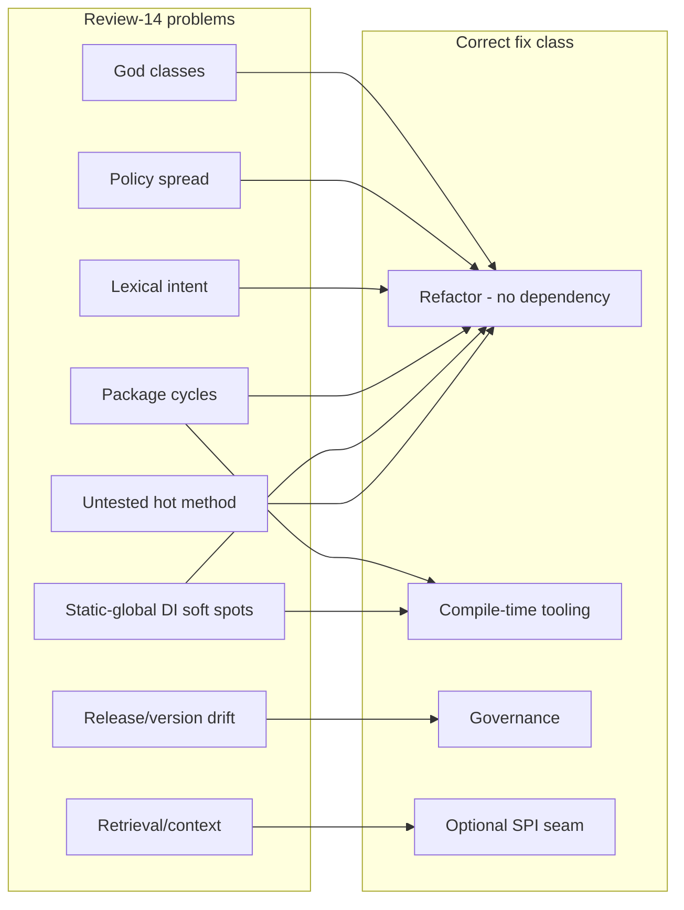
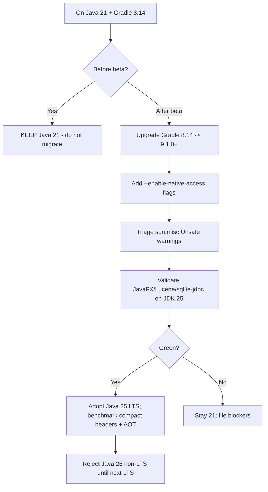
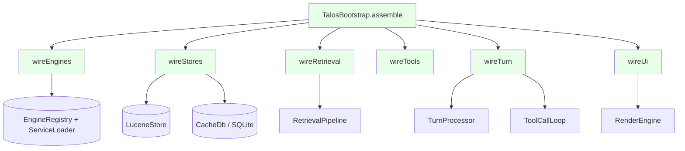
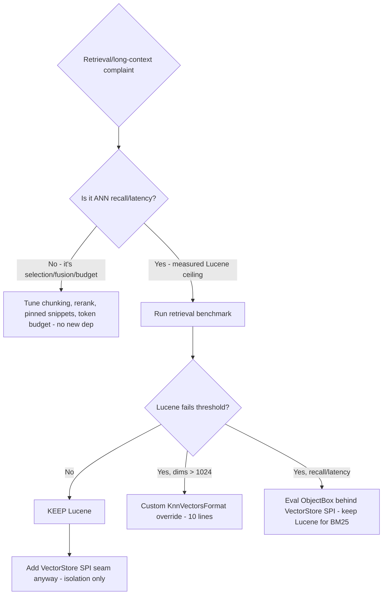
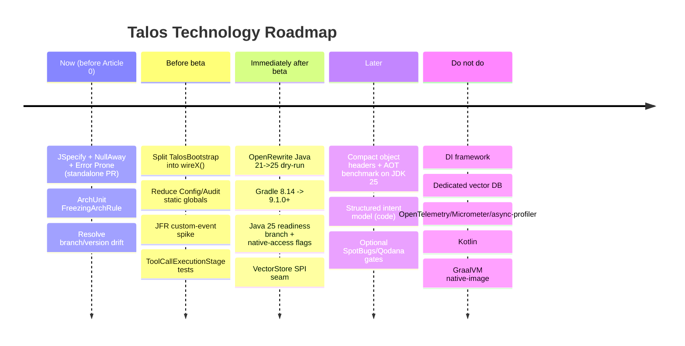

# Talos Technology Modernization and Dependency Strategy

> Companion to `14-current-architecture-design-review.md`. This is a **decision-quality** review, not an
> implementation plan and not a dependency-shopping list. No production code was changed, no dependencies
> were added, no build files were edited. Web claims are cited to primary sources (see Appendix A).
> "Current evidence" (measured/cited) is kept separate from "future speculation." This original review
> snapshot predates the T625/T626 static-web browser-verification work; see the 2026-06-01 addendum below.

**Decision labels used:** `KEEP_CURRENT`, `ADOPT_NOW`, `SPIKE_NOW`, `DEFER_POST_BETA`, `DEFER_LONG_TERM`,
`REJECT`, `NEEDS_MORE_DATA`.

---

## 2026-06-01 Addendum: HtmlUnit Runtime Dependency

**Decision:** `ADOPT_NOW`, scoped to the static-web verifier lane only.

T625 introduced `org.htmlunit:htmlunit:4.21.0` as an `implementation` dependency, pinned through
`htmlUnitVersion` in `gradle.properties`. That scope is intentional: the verifier lives in `src/main` and
runs during Talos's real post-apply verification, so HtmlUnit is a runtime capability, not test tooling.

The dependency is accepted under narrow conditions:

- The only production entry point is `dev.talos.runtime.verification.StaticWebBrowserBehaviorVerifier`.
- It may verify workspace-local static-web click/update claims by loading pages through a synthetic
  `http://talos.local` workspace origin and dispatching DOM events.
- Its workspace-serving WebClient must keep blocking non-workspace requests; `about:` and `data:` remain the
  only non-workspace schemes allowed.
- It must fail closed: script errors become verifier failures, runner exceptions become `UNAVAILABLE`, and no
  DOM change becomes `FAILED`.
- It must not be reused as general browser automation, internet browsing, rendering proof, screenshot proof,
  or arbitrary JavaScript execution outside the static-web verification lane.
- JaCoCo test instrumentation excludes HtmlUnit packages; coverage gates measure Talos code, not third-party
  dependency internals that can exceed bytecode instrumentation limits.
- Because HtmlUnit is a heavy transitive dependency, future uses require a specific ticket and evidence that
  the work cannot be handled by the existing verifier entry point.

T626 tightened the fallback path so authoritative `BROWSER_BEHAVIOR` means an observed output change across
the click boundary, not merely a DOM mutation during linked-script eval. T627 replaced direct `file:` page
loading with the synthetic workspace origin because HtmlUnit bypasses `WebConnection` for `file:` URLs. The
causally checked fallback remains because HtmlUnit still does not give reliable natural handler observation for
ordinary external-script listeners; a future external-browser lane must be governed and `UNAVAILABLE` by default
when not configured.

---

## 1. Executive Verdict

**Blunt one-page verdict.** Talos's current technology stack is well-chosen for a local-first Java CLI and
should be **mostly kept**. The biggest improvement levers are **not** new frameworks or databases - they are
(a) finishing the god-class decomposition already identified in review 14, and (b) adding **zero-runtime-cost,
compile-time correctness tooling**. The shiny options most likely to *damage* Talos are a DI framework
(Spring/Micronaut/CDI), a dedicated vector database (Qdrant/Chroma/Milvus/DuckDB-VSS), and OpenTelemetry -
each adds runtime weight, startup cost, background services, or framework gravity that directly contradicts
the local-first/trust doctrine while solving no real Talos problem.

- **Stay on Java 21 for now?** **Yes** (`KEEP_CURRENT` through beta). Java 25 is LTS (GA 2025-09-16) and
  attractive, but **Gradle 8.14 cannot run on or target JDK 25** - that needs Gradle 9.1.0+, a separate major
  migration. Sequence it deliberately, post-beta.
- **Plan Java 25?** **Yes, as a post-beta readiness spike** (`DEFER_POST_BETA`). Real wins: Scoped Values
  (finalized), AOT startup, compact object headers, JFR method timing. Gated on Gradle 9.x.
- **Introduce Kotlin?** **No** (`REJECT` for now / `DEFER_LONG_TERM` for a possible future Android path). It
  solves no current Talos problem and adds build/interop/contributor cost.
- **Introduce a DI framework?** **No** (`REJECT`). The real problem is god-class decomposition, which no DI
  container fixes. Keep the explicit composition root; split `TalosBootstrap` into `wireX()` units.
- **Replace/augment Lucene retrieval?** **No replacement** (`KEEP_CURRENT`). Lucene 10.2.2 already gives
  first-party RRF (`TopDocs.rrf()`), binary/scalar quantization, ACORN filtered-KNN, and Panama SIMD. Talos's
  long-context problem is **context-selection, not vector storage**.
- **Worth spikes:** OpenRewrite (Java 21→25 migration recipes), JFR custom events for latency, a `VectorStore`
  SPI seam (design only), and a Java-25 readiness branch.
- **Rejected:** Spring/Micronaut/CDI DI, Qdrant/Chroma/Milvus/DuckDB-VSS/LanceDB, OpenTelemetry, Micrometer,
  async-profiler (no Windows build), Checker Framework, jQAssistant (embedded Neo4j), Kotlin (now).
- **Biggest hidden risk:** **Toolchain coupling.** Moving to Java 25 silently drags in a **Gradle 9.x major
  upgrade** plus new `--enable-native-access` requirements for `sqlite-jdbc`/JavaFX and `sun.misc.Unsafe`
  warnings - a multi-part migration that looks like "bump one number" but isn't.

**Top 5 ADOPT/KEEP**
1. `KEEP_CURRENT` - Explicit composition root (no DI framework).
2. `KEEP_CURRENT` - Lucene 10.2.2 hybrid retrieval (BM25+KNN+RRF+rerank).
3. `ADOPT_NOW` - JSpecify 1.0.0 nullness annotations (zero runtime, ~8 KB).
4. `ADOPT_NOW` - ArchUnit `FreezingArchRule` (library already in build; ratchets god-class/cycle debt).
5. `ADOPT_NOW` - NullAway + Error Prone (compile-time, javac-layer, no runtime deps).

**Top 5 SPIKE candidates**
1. `SPIKE_NOW` - OpenRewrite dry-run for Java 21→25 build migration recipe.
2. `SPIKE_NOW` - JFR custom events (`LlmCallEvent`, `RetrievalEvent`, `ToolLoopEvent`) for latency evidence.
3. `SPIKE_NOW` - `VectorStore` SPI seam (interface only; keep Lucene as sole impl).
4. `DEFER_POST_BETA` - Java 25 readiness branch (Gradle 9.x + native-access flags).
5. `DEFER_POST_BETA` - Compact object headers (`-XX:+UseCompactObjectHeaders`) benchmark on JDK 25.

**Top 5 REJECT/DEFER**
1. `REJECT` - Spring/Spring Boot as a CLI DI container (1.5-3 s startup *per invocation*).
2. `REJECT` - Dedicated vector DB (Qdrant/Chroma/Milvus server; DuckDB-VSS persistence "not for production").
3. `REJECT` - OpenTelemetry (cloud/distributed-tracing oriented; 5-20 MB; needs a collector).
4. `REJECT` - async-profiler (no Windows binary; relies on Linux `perf_events`).
5. `DEFER_LONG_TERM` - Kotlin (only if a real Android target materializes).

---

## 2. Evidence Base

- **Branch:** `feature/archunit-architecture-guards` · **Commit:** `8c749bba`.
- **Repo:** `ai21z/talos-assistant`, Java 21, Gradle 8.14 (Kotlin DSL), JUnit 5.
- **Current dependency versions (from `gradle.properties` / `build.gradle.kts`):** Lucene 10.2.2,
  sqlite-jdbc 3.46.0.0, Jackson 2.17.1, Picocli 4.7.6, JLine 3.26.3, JavaFX 21.0.3 (win), PDFBox 3.0.7,
  POI 5.5.1, HtmlUnit 4.21.0, SLF4J 2.0.12, Logback 1.4.14, ArchUnit 1.4.2. `talosVersion=0.9.9`,
  `javaVersion=21`.
- **Build facts confirmed:** Tests already run with `--add-modules jdk.incubator.vector` (Lucene ANN SIMD);
  `jpackage` + `installDist` tasks present; JavaFX bundled (win classifier).
- **Local source inspected:** `core.retrieval` (RetrievalPipeline/Stage/StageOutput/RetrievalCandidate),
  `core.index.LuceneStore` (`KnnFloatVectorField` + BM25 fields), `core.embed` (OpenAI-compatible
  `CompatEmbeddingsClient`, `CachingEmbeddings`), `core.cache.CacheDb` (SQLite: `embedding_cache` BLOB,
  `answer_cache`, `sessions`, `memory`, `model_dimensions`), `core.rerank` (NoOp/ScoreThreshold).
- **Reports/docs read:** `docs/architecture/14-current-architecture-design-review.md` (primary local
  evidence), `11`/`12`/`13` architecture docs, `.github/assistant-instructions.md`, `AGENTS.md`, `README.md`.
- **Commands run:** `git status/branch/rev-parse`; `.\gradlew.bat test --tests "dev.talos.architecture.*"
  --no-daemon` (**BUILD SUCCESSFUL**, 11 hard guards + 3 report-only tests pass); PowerShell version/stack
  enumeration.
- **Web research:** 4 primary-source research passes (Java 25/26; local-first vector stores; Java DI
  frameworks; static-analysis + observability). Full citations in Appendix A.
- **What was NOT run / unknown:** No full `.\gradlew.bat test` (>24 min, backend-dependent - see review 14).
  No benchmarks executed (retrieval/latency/footprint numbers below are proposed, not measured). No
  dependency was actually added or upgraded. Repository visibility (public vs private) not verified - this
  affects CodeQL licensing (see §8). Exact embedding model/dimensions are runtime-configured (the code reads
  `dim` dynamically), so the 1024-dim Lucene ceiling impact is model-dependent and unconfirmed for Talos's
  default profile.

---

## 3. Talos Architectural Needs From Current Review

Summary of review 14, classified by problem *type* (this matters because the right fix differs by type):

| Finding (from review 14) | Problem type | Does a new technology help? |
|---|---|---|
| `AssistantTurnExecutor` 3191 LOC, `TurnProcessor` 1196 LOC god-objects | Architectural decomposition | **No** - pure refactor |
| `TaskContractResolver` 1258 / `MutationIntent` 418 lexical/regex sprawl | Architectural + correctness | Marginal - structured intent model is code, not a library |
| Policy spread across 31 `runtime.policy` classes + inline logic | Architectural decomposition | **No** |
| `ExecutionOutcome` is a record acting as a policy engine | Architectural decomposition | **No** |
| `context↔llm` cycle; `core→tools` (8 edges); `rerank↔retrieval` | Architectural decomposition | **No** - ArchUnit can *guard* once fixed |
| `LlmClient` 1093 LOC overloaded | Architectural decomposition | **No** |
| Framework-free DI working but static globals (`Config`/`Audit`/`CfgUtil`) | DI / test-seam | **No framework** - inject instances; JSR-330 annotations optional |
| `ToolCallExecutionStage` god-method untested | Testing/evidence | **No** - write tests |
| Branch/version drift (`v0.9.0-beta-dev` vs `0.9.9`; default `main`) | Product/release | **No** - governance |
| Retrieval/context status (Lucene hybrid, token budgeting, compaction) | Retrieval/storage | **No replacement needed**; possible SPI seam |

**Key conclusion:** Of the 10 headline problems, **8 are decomposition/testing/release problems that no
dependency solves.** Only the nullness/correctness gap and the architecture-debt-ratchet gap have a genuine
*tooling* answer (JSpecify/NullAway/Error Prone, ArchUnit freeze). This framing should discipline every
recommendation below: **do not import a framework to avoid a refactor.**



---

## 4. Java 21 vs Java 25 vs Java 26

**Current evidence (cited):**
- **JDK 25 = LTS, GA 2025-09-16** (openjdk.org/projects/jdk/25). **JDK 26 = non-LTS, GA 2026-03-17**
  (openjdk.org/projects/jdk/26), patch 26.0.1 on 2026-04-21.
- **Gradle compatibility (decisive):** Gradle 8.14 supports running on / targeting **up to JDK 24 only**;
  **JDK 25 requires Gradle 9.1.0+**, JDK 26 requires Gradle 9.4.0+ (docs.gradle.org compatibility matrix).
  Talos is on Gradle 8.14, so a JDK 25 move is **really a Gradle 9.x major migration**.

| Capability | JEP / status | Talos relevance |
|---|---|---|
| Scoped Values | **JEP 506, finalized in 25** | Replace `ThreadLocal` in `TurnAuditCapture`/trace; propagate trace IDs/deadlines through call tree. Real, low-risk win - but needs JDK 25. |
| Structured Concurrency | **JEP 505/525, still PREVIEW in 25/26** | Parallel model calls / retrieval fan-out with fail-fast cancellation - but `--enable-preview` and API churn make it unsafe to depend on. Wrap behind a facade if used. |
| Vector API | **JEP 508/529, still INCUBATOR** (blocked on Valhalla) | Already enabled for Lucene ANN. Lucene owns this internally; do not hand-roll SIMD. |
| JFR Method Timing & Tracing | **JEP 520, product in 25** | Per-method latency (LlmClient, Lucene search, SQLite) with no source changes. Strong observability win. |
| JFR CPU-Time / Cooperative Sampling | JEP 509 (experimental, Linux) / **518 (product)** | Safer sampling with many virtual threads. CPU-time profiling Linux-only. |
| AOT ergonomics + method profiling | **JEP 514/515, product in 25** | CLI cold-start is the enemy; pre-warmed JIT profiles measured ~10-19% faster warmup. Strong fit for a CLI. |
| Compact Object Headers | **JEP 519, product (opt-in) in 25** | ~10-22% heap + ~15% fewer GC cycles on object-heavy workloads (Lucene docs/terms, Jackson nodes). Opt-in `-XX:+UseCompactObjectHeaders`. |
| AOT Object Caching any GC | JEP 516, product in 26 | ZGC + AOT cache combined. Minor for a CLI. |
| G1 throughput (dual card table) | JEP 522, product in 26 | Free 5-15% throughput for Lucene/Jackson write-heavy paths. |
| HTTP/3 client | JEP 517, product in 26 (opt-in) | Only if a local model server speaks HTTP/3 (rare). No migration needed. |

**Migration risks Java 21→25 (cited):**
- `sun.misc.Unsafe` memory-access = **warn by default in 25** (JEP 471). Lucene 10 already uses FFM
  `MemorySegment` (low risk); audit JLine/Jackson internals with `--sun-misc-unsafe-memory-access=debug`.
- **JNI restriction** (JEP 472, since 24): `sqlite-jdbc` and JavaFX use native code → need
  `--enable-native-access=ALL-UNNAMED` to avoid warnings/denials.
- Security Manager permanently disabled (JEP 486) - low risk for Talos.
- JDK 26 adds final-field deep-reflection warnings (JEP 500) - verify Jackson/Picocli on 26.

**Decision labels:**
- Stay on Java 21 now → **`KEEP_CURRENT`** (through beta).
- Java 25 readiness branch → **`SPIKE_NOW` (design) / `DEFER_POST_BETA` (execute)**.
- Upgrade before beta → **No.**
- Upgrade after beta → **Yes, gated on Gradle 9.x.**
- Java 26 now → **`REJECT`** (non-LTS; chase 25 LTS).

**Migration checklist (post-beta):** ① Gradle 8.14→9.1.0+ (handle 9.x breaking changes:
`configurations.create`→`register`, removed deprecations, TestKit/Tooling API). ② Set
`--enable-native-access=ALL-UNNAMED` in run/installDist/jpackage launchers. ③ Run with
`--sun-misc-unsafe-memory-access=debug` and triage. ④ Verify JavaFX 21 on JDK 25 (or bump JavaFX). ⑤ Validate
Lucene 10.2.2 + Panama on 25. ⑥ Benchmark `-XX:+UseCompactObjectHeaders` and AOT cache. **Acceptance:** full
suite + e2e packs green on JDK 25; no native-access/Unsafe warnings in startup; jpackage image launches on
Windows. **Timing:** immediately after beta.



---

## 5. Kotlin Evaluation

**What Kotlin would offer Talos:** nicer value objects / sealed hierarchies (policy & turn-state models),
null-safety, data classes, DSL-ish policy definitions.

**Why it does not fit now (current evidence):**
- Java 21 already has **records + sealed interfaces + pattern matching**, which cover the value-object and
  sealed-hierarchy use cases Talos actually has (`CurrentTurnPlan`, `OutcomeDominancePolicy.Facts/Decision`).
- Kotlin **null-safety degrades to platform types** across the large Java surface (Lucene, Jackson, Picocli,
  JLine, JavaFX) - the safety benefit is partial exactly where Talos touches third-party APIs.
- **Build/tooling cost:** adds the Kotlin Gradle plugin, a second compiler, mixed-source incremental-build
  complexity, and ArchUnit/Error-Prone/NullAway interop questions.
- **Contributor cost:** Talos is Java-first; mixed-language lowers contribution clarity.
- **Android future** is speculative; there is no current Android target.

**Decision:** **`REJECT` now** (Java-first), **`DEFER_LONG_TERM`** if a concrete Android/multiplatform target
appears. If ever spiked: limit to **new, leaf, pure-logic modules only** (e.g., a future structured-intent
model), never the Java-interop-heavy runtime spine, with acceptance = no build-time regression and clean
Java↔Kotlin interop tests. Do not migrate tests-only or the spine.

---

## 6. DI and Composition Strategy

**Current state:** explicit composition root `TalosBootstrap` (607 LOC, fan-out 88) wiring ~20 collaborators
via constructor injection + small callbacks; one `ServiceLoader.load(ModelEngineProvider.class)` at the SPI
edge (`core.engine.EngineRegistry`); two `META-INF/services` provider files. Soft spots: static globals
`Config`/`Audit`/`CfgUtil`.

**Framework evaluation (current evidence - see Appendix A, DI sources):**

| Option | What it would solve | What it would NOT solve | Startup | Runtime reflection | Native/AOT | Gravity | Verdict |
|---|---|---|---|---|---|---|---|
| **Explicit root (incumbent)** | Already solves wiring | God-class size (refactor needed) | 0 ms | None | ★★★★★ | None | **`KEEP_CURRENT`** |
| Dagger 2 | Compile-time graph validation at 50+ components | Nothing Talos needs at 20 components | ~0 ms | None | ★★★★★ | Low | `DEFER_LONG_TERM` (least-bad if ever) |
| Guice 7 | Runtime binding | Decomposition; adds reflection | 50-300 ms | Heavy | ★★ | Low | `REJECT` |
| Micronaut | Compile-time DI | Pulls full-stack framework | 100-500 ms | Minimal | ★★★★ | **High** | `REJECT` |
| Spring/Boot | "Everything" | CLI startup; massive footprint | **1500-3000 ms/invocation** | Heavy | ★★★ | **Extreme** | `REJECT` |
| Jakarta CDI / Weld | Standard CDI | Fat-jar friction; proxies | 300-1000 ms | Heavy | Medium | `REJECT` |
| JSR-330 annotations only | Document injection points | Nothing functional | 0 ms | None | ★★★★★ | None | `ADOPT_NOW` (optional, `compileOnly`) |

**The blunt answer (from research):** *No DI framework solves a concrete Talos problem better than the
explicit root.* The stated pain ("600-line wiring class") is **god-class decomposition** - a 30-minute
`wireX()` split - not a wiring-resolution problem. A framework *relocates* the 600 lines into modules +
`@Inject` annotations; it does not shrink them, and it adds startup/reflection/gravity that fights
local-first trust and fast CLI invocation.

**Recommended composition-root shape (no framework):**
```
TalosBootstrap.assemble(cfg):
  engines  = wireEngines(cfg)        // ServiceLoader + EngineRegistry
  stores   = wireStores(cfg)         // LuceneStore, CacheDb, SessionStore
  retrieval= wireRetrieval(cfg, stores, engines)
  tools    = wireTools(cfg, stores)  // ToolRegistry registrations
  turn     = wireTurn(cfg, engines, tools, retrieval)  // TurnProcessor, ToolCallLoop
  ui       = wireUi(cfg, turn)       // RenderEngine, CliApprovalGate
```
**Steps to reduce static/global coupling without a framework:** ① introduce `Clock`, `ConfigView`, and an
`AuditSink` interface; ② convert `Audit`/`Config` static call sites to injected instances incrementally
(strangler pattern), keeping static facades as thin delegates until migrated; ③ pass `CfgUtil` results in as
constructor params rather than calling statics deep in the graph. **JSR-330 worth it?** Only as
*documentation-only* `@Inject` markers (`jakarta.inject-api`, ~6 KB, `compileOnly`) - never wired to a
container.



---

## 7. Vector Store / Retrieval / Long Context Strategy

**Current Talos retrieval (inspected):**
- **Index:** Apache Lucene 10.2.2 (`LuceneStore`). Each chunk doc carries BM25 text fields
  (`F_TEXT`, `F_NAME`, `F_PATHTOK`), a dense vector via `KnnFloatVectorField(F_VEC, vec)` (HNSW), and
  structured metadata (lang, line range, heading, source identity).
- **Embeddings:** local **OpenAI-compatible** server (`CompatEmbeddingsClient`); dimension read dynamically;
  results cached in SQLite (`embedding_cache` BLOB, keyed by sha1(model+text)) via `CachingEmbeddings`.
- **Pipeline:** `RagService.prepare()` → `RetrievalPipeline.execute()` with stages
  **BM25 → KNN → RRF Fusion → SourceBoost → Rerank → Dedup**; stages stateless over immutable `StageOutput`.
- **Rerank:** `NoOpReranker` / `ScoreThresholdReranker`.
- **Context:** `ContextPacker` (chars/4 token heuristic, response+overhead reservation, pinned-snippet
  priority, sanitize/dedup/truncate, citation metadata); `ConversationManager` + `ConversationCompactor`
  (sketch-based compaction); `TokenBudget`.
- **Storage:** Lucene index dir + SQLite cache (`answer_cache`, `sessions`, `memory`, `model_dimensions`).

**Would a vector DB help? Candidate evaluation (current evidence - Appendix A, vector sources):**

| Candidate | Embedded/server | Java story | Windows | BM25+vector+RRF | Persistence | License | Verdict |
|---|---|---|---|---|---|---|---|
| **Lucene 10.2.2 (incumbent)** | Embedded, pure Java | Native | Zero friction | **Native first-class** (`TopDocs.rrf()` since 10.2.0) | Stable | Apache-2.0 | **`KEEP_CURRENT`** |
| sqlite-vec | SQLite ext (DLL) | **No Java bindings** | Manual DLL load | No BM25 | OK | MIT | `REJECT` (pre-v1, no Java) |
| DuckDB VSS | JDBC embedded | Good JDBC | Bundled | No BM25 | **"not for production" (data-loss on crash)** | MIT | `REJECT` |
| LanceDB | OSS embedded = Py/TS/Rust | **Java = cloud only** | N/A | N/A | Apache-2.0 | `REJECT` |
| ObjectBox | Embedded JNI | Good (bundled native) | Bundled DLL | **No BM25** | LMDB file | Apache-2.0 | `NEEDS_MORE_DATA` (only if Lucene blocker appears) |
| hnswlib/FAISS JNI | Native | **No maintained Java wrapper** | Complex build | Vector only | File | Apache/MIT | `REJECT` |
| Qdrant | **Server only** | gRPC client | Background proc | partial | server | Apache-2.0 | `REJECT` |
| Chroma / Milvus | **Server / Python-first** | No/cloud Java | Background proc | partial | Apache-2.0 | `REJECT` |

**Clear answers:**
- **Is current Lucene vector support good enough?** **Yes.** 10.2.x added first-party RRF, binary
  quantization (~32×) and scalar SQ (~4-8×), ACORN-1 filtered KNN (up to 5× on filtered queries),
  `SeededKnnVectorQuery`, and Panama SIMD. It is embedded, offline, zero-install, Apache-2.0.
- **Vector-store problem or context-selection problem?** **Context-selection.** Talos's long-context quality
  is governed by chunking, fusion weighting, rerank quality, pinned-snippet policy, and token budgeting -
  not by the ANN engine. Swapping the store would *move* complexity, not reduce it, and would likely *lose*
  native hybrid BM25+RRF (every alternative lacks BM25).
- **Add a `VectorStore` SPI now?** **Yes - interface only** (`SPIKE_NOW`), keeping Lucene as the sole
  implementation. This isolates retrieval behind a seam (helps the `rerank↔retrieval` cycle from review 14)
  and future-proofs without adopting anything.
- **Test a second backend behind the adapter?** **Not now.** Only if a benchmark proves a Lucene ceiling.
- **The one real Lucene caveat:** built-in HNSW codecs cap vectors at **1024 dims**. Models >1024
  (e.g., `text-embedding-3-large`=3072) need a ~10-line custom `KnnVectorsFormat` override - not a DB change.
  Talos's default embedding dimension is runtime-configured and unverified here; **confirm it is ≤1024**.

**Proposed retrieval benchmark (to prove/deny any need):**
- **Dataset shape:** 3 fixture workspaces - small (~500 files), medium (~5k), large (~50k) - mixed code +
  Markdown + config.
- **Query types:** exact-symbol, natural-language "where is X", cross-file concept, path-scoped, negative
  (no-answer).
- **Metrics:** recall@10, MRR/nDCG vs a hand-labeled gold set; p50/p95 query latency; index build time;
  index disk size; peak heap; cold-start.
- **Pass/fail thresholds (illustrative, tune on first run):** recall@10 ≥ 0.85 on gold set; p95 query <
  150 ms on medium; index disk < 2× raw corpus with SQ7; no OOM at large under 2 GB heap.
- **Footprint/latency/recall/setup** captured per backend. **Only if Lucene fails a threshold** do we
  evaluate ObjectBox-behind-adapter. Until then: **stay on Lucene.**



---

## 8. Nullness, Static Analysis, and Correctness Tooling

All compile-time / zero-runtime-dependency unless noted (Appendix A, tooling sources).

| Tool | Problem solved | Integration cost | False-positive risk | Beta timing | Verdict |
|---|---|---|---|---|---|
| **JSpecify 1.0.0** | Standard `@Nullable`/`@NullMarked` semantics | 1 line, ~8 KB annotations, no runtime | None (annotations only) | Now | **`ADOPT_NOW`** |
| **NullAway 0.13.4** | NPE contracts at javac time, <10% build cost | Error Prone plugin | Low (local flow) | Before beta (incremental, `@NullMarked` per package) | **`ADOPT_NOW`** |
| **Error Prone 2.49.0** | Broad bug patterns at javac | `net.ltgt.errorprone` plugin | Low (default checks) | Before beta | **`ADOPT_NOW`** |
| Checker Framework | Sound nullness + more | Heavy annotations, stubs | **High** | - | `REJECT` (NullAway gives 80% at 5% cost) |
| SpotBugs 4.9.8 | Bytecode bug patterns | Gradle plugin, on-demand task | Moderate | Optional | `DEFER_POST_BETA` |
| **ArchUnit `FreezingArchRule`** | Ratchet existing god-class/cycle debt without failing build | **Zero - lib already present** | None | Now | **`ADOPT_NOW`** |
| jQAssistant | Architecture queries | **High - embedded Neo4j, server** | - | - | `REJECT` (violates no-runtime-complexity) |
| CodeQL custom queries | Deep semantic/security queries | CLI + DB build | Low | - | `NEEDS_MORE_DATA` → `REJECT if repo private` (CLI not free for private repos w/o GHAS) |
| **OpenRewrite** | Automated Java 21→25 + nullness recipes | Gradle plugin / init-script dry-run | Low (lossless trees) | Spike pre-25 | **`SPIKE_NOW`** |
| Qodana / Sonar | Aggregate quality gates | CI (governance-gated) | Medium | Per governance | `DEFER_POST_BETA` (standalone approved PR per assistant-instructions) |

**Priority:** JSpecify + NullAway + Error Prone + ArchUnit-freeze are the highest-value, lowest-risk moves -
all compile-time, no runtime deps, directly attacking review-14's correctness and architecture-debt gaps.
**Governance note:** these are *quality tooling*; per `.github/assistant-instructions.md` they must reach
`v0.9.0-beta-dev`/`main` only via a **standalone approved PR**, not bundled into a feature branch.

---

## 9. Observability and Performance Tooling

| Tool | Fit | Verdict |
|---|---|---|
| **JFR / JMC** | Built-in, zero-dep, full Windows support, custom events (`LlmCallEvent`, `RetrievalEvent`, `ToolLoopEvent`, `IndexingEvent`); JDK 25 adds method timing/tracing without source changes | **`ADOPT_NOW` (spike custom events)** |
| **`LocalTurnTraceCapture` (existing)** | Already structured per-turn tracing with tests | **Extend first** before any external lib |
| async-profiler | **No Windows binary** (relies on Linux `perf_events`) | `REJECT` |
| Micrometer | Always needs a `MeterRegistry`; runtime jar (~400 KB); export-oriented | `REJECT` |
| OpenTelemetry | Distributed-tracing/cloud-oriented; 5-20 MB; needs a collector | `REJECT` |
| Gradle build-scan/report tasks | Build-time only | `DEFER_POST_BETA` (optional) |

**Focus areas** (LlmClient latency, tool-loop latency, retrieval latency, context-packing cost, indexing
cost, local-model timeout/idle/repetition): all are answerable with **JFR custom events + extending
`LocalTurnTraceCapture`** - zero added runtime deps, Windows-first. **Add now:** JFR event spike. **Defer:**
build-scan tasks. **Reject:** async-profiler, Micrometer, OTel.

---

## 10. Packaging and Runtime Distribution

**Current:** `installDist` + `jpackage` tasks already exist (Windows-first, icon, app-image). Stable jar name
`talos.jar`.

| Option | Assessment | Verdict |
|---|---|---|
| Keep `installDist`/`jpackage` | Works; Windows-first; bundles JRE via jpackage | **`KEEP_CURRENT`** |
| jpackage native installer polish | Already wired; minor improvements possible | `DEFER_POST_BETA` |
| GraalVM native-image | JavaFX + JNI (`sqlite-jdbc`) + reflection (Jackson/Picocli) make native-image **high-effort**; large config surface; questionable benefit for a JRE-bundled CLI | `REJECT` (now) / `NEEDS_MORE_DATA` (long-term) |
| Java 25 AOT cache (`-XX:AOTCache`) | Lower-risk startup win than native-image; needs JDK 25 | `DEFER_POST_BETA` |
| Bundled JRE vs require Java | jpackage already bundles - keep | `KEEP_CURRENT` |

**Do not over-optimize packaging before beta.** No evidence packaging blocks adoption today.

---

## 11. Other Libraries/Technologies Worth Considering

| Candidate | Might help | Might distract | Verdict |
|---|---|---|---|
| **Parser-combinator / structured intent parser** (hand-rolled, no lib) | Replaces brittle regex `MutationIntent`/`TaskContractResolver` with a typed grammar | A library adds dependency for what is small bespoke logic | `SPIKE_NOW` (as **code**, not a dependency) |
| JSON-schema validation (config/tool-call) | Validate `ToolCall`/config shapes | Jackson already present; schema lib may be overkill | `NEEDS_MORE_DATA` |
| State-machine lib (turn/phase) | Formalize `ExecutionPhase` transitions | Enum + switch already suffices | `REJECT` |
| Markdown rendering lib (CLI output) | Richer REPL output | JLine + current rendering adequate | `DEFER_POST_BETA` |
| File-watching (re-index on change) | Live index updates | Adds daemon-like behavior; conflicts with deliberate model | `DEFER_LONG_TERM` |
| Snapshot/checkpoint storage upgrade | Durable checkpoints | `CheckpointService` + SQLite already exist | `KEEP_CURRENT` |
| Jackson alternative | - | No evidence of pain | `REJECT` |
| Picocli/JLine modernization | - | No evidence of pain; both current | `KEEP_CURRENT` |
| Logging/redaction lib | - | `safety` layer + SafeLogFormatter already strong | `KEEP_CURRENT` |

---

## 12. Decision Matrix

| Candidate | Problem it claims to solve | Actual Talos problem? | Local-first fit | Trust-model fit | Install/runtime cost | Build complexity | Maintenance risk | Beta timing | Confidence | Verdict |
|---|---|---|---|---|---|---|---|---|---|---|
| Java 25 LTS | Modern runtime/perf | Partial (Scoped Values, AOT, headers) | High | Neutral | Low (but Gradle 9.x) | **High (Gradle 9 + flags)** | Low | Post-beta | High | `DEFER_POST_BETA` |
| Java 26 | Latest | No (non-LTS) | High | Neutral | Low | High | Med | - | High | `REJECT` |
| Kotlin | Better types/null-safety | No (records/sealed suffice) | Med | Neutral | Med | High | Med | - | High | `REJECT`/`DEFER_LONG_TERM` |
| Explicit composition root | Wiring | **Yes (keep)** | High | High | Zero | None | None | Now | High | `KEEP_CURRENT` |
| Dagger 2 | Compile-time DI | No (20 deps) | High | High | ~0 | Low | Low | - | High | `DEFER_LONG_TERM` |
| Guice/Micronaut/Spring/CDI | DI container | No | Low | **Low** | Med-High | Med-High | Med | - | High | `REJECT` |
| JSR-330 annotations | Document injection | Minor | High | High | Zero | None | None | Now | Med | `ADOPT_NOW` (optional) |
| Lucene 10.2.2 hybrid | Retrieval | **Yes (keep)** | High | High | Zero | None | Low | Now | High | `KEEP_CURRENT` |
| Vector DB (Qdrant/Chroma/Milvus) | ANN search | No (server) | **Low** | **Low** | High (server) | High | Med | - | High | `REJECT` |
| DuckDB VSS / sqlite-vec / LanceDB | ANN search | No (no BM25 / no Java / data-loss) | Low-Med | Med | Med | Med | **High** | - | High | `REJECT` |
| ObjectBox | Embedded ANN | Only if Lucene ceiling | Med | Med | Med (JNI) | Med | Low | - | Med | `NEEDS_MORE_DATA` |
| VectorStore SPI seam | Isolation/future-proof | Yes (design) | High | High | Zero | Low | None | Spike | Med | `SPIKE_NOW` |
| JSpecify | Nullness standard | Yes (correctness) | High | High | Zero (8 KB) | None | None | Now | High | `ADOPT_NOW` |
| NullAway + Error Prone | NPE/bug at compile | Yes (correctness) | High | High | Zero runtime | Low (plugin) | Low | Before beta | High | `ADOPT_NOW` |
| ArchUnit FreezingArchRule | Debt ratchet | Yes (cycles/god-class) | High | High | Zero (present) | None | None | Now | High | `ADOPT_NOW` |
| Checker Framework | Sound nullness | Over-solves | High | High | Annotation-heavy | High | Low | - | High | `REJECT` |
| SpotBugs | Bug patterns | Marginal | High | High | Low | Low | Low | Optional | Med | `DEFER_POST_BETA` |
| jQAssistant | Arch queries | No (Neo4j) | **Low** | Med | High (server) | High | Med | - | High | `REJECT` |
| CodeQL | Semantic/security | Maybe | Med | Med | Med | Med | Low | - | Med | `REJECT if private` |
| OpenRewrite | Automated migration | Yes (Java 25 prep) | High | High | Zero runtime | Low | Low | Spike | Med | `SPIKE_NOW` |
| JFR custom events | Local latency evidence | Yes (perf) | High | High | Zero (built-in) | Low | None | Now | High | `ADOPT_NOW` |
| async-profiler | Profiling | Yes but no Windows | **Incompatible** | Med | - | - | - | - | High | `REJECT` |
| Micrometer/OpenTelemetry | Metrics/tracing | No (cloud) | **Low** | Med | Med-High | Med | Med | - | High | `REJECT` |
| GraalVM native-image | Startup/size | Marginal | Med | High | High effort | **High** | Med | - | Med | `REJECT` now |
| Java 25 AOT cache | Startup | Yes (post-25) | High | High | Low | Low | Low | Post-beta | Med | `DEFER_POST_BETA` |

**Scoring (0-10) for major candidates** - axes: solves-real-problem / local-first / trust-fit /
impl-simplicity / maintenance-impact / runtime-install-cost / beta-timing-fit / strategic-value:

| Candidate | Solve | Local | Trust | Simpl | Maint | Cost | Timing | Strat | Why (1-line) |
|---|---:|---:|---:|---:|---:|---:|---:|---:|---|
| Keep explicit DI root | 9 | 10 | 10 | 9 | 8 | 10 | 10 | 7 | Solves wiring; refactor (not framework) fixes size |
| Keep Lucene retrieval | 9 | 10 | 10 | 8 | 8 | 10 | 10 | 8 | Native hybrid BM25+RRF; alternatives regress |
| JSpecify + NullAway + EP | 8 | 10 | 9 | 7 | 8 | 10 | 8 | 8 | Compile-time correctness, zero runtime cost |
| ArchUnit freeze | 7 | 10 | 9 | 9 | 9 | 10 | 9 | 7 | Ratchets review-14 debt; already in build |
| JFR custom events | 7 | 10 | 9 | 7 | 8 | 10 | 8 | 7 | Local latency evidence, Windows-first, no deps |
| OpenRewrite spike | 6 | 9 | 8 | 7 | 7 | 9 | 6 | 7 | De-risks Java 25 migration mechanically |
| Java 25 LTS (post-beta) | 6 | 9 | 7 | 4 | 6 | 7 | 4 | 8 | Real perf, but Gradle 9 + native-access coupling |
| VectorStore SPI seam | 5 | 10 | 9 | 7 | 8 | 10 | 6 | 7 | Isolation/future-proof without adopting a DB |
| Kotlin | 3 | 6 | 6 | 3 | 5 | 6 | 2 | 5 | No current problem; build/interop cost |
| DI framework (Spring/MN/CDI) | 2 | 3 | 3 | 3 | 5 | 3 | 2 | 3 | Startup/gravity; doesn't fix god-classes |
| Dedicated vector DB | 2 | 3 | 3 | 3 | 4 | 3 | 2 | 4 | Server/no-BM25/data-loss; moves complexity |
| OpenTelemetry/Micrometer | 2 | 3 | 5 | 4 | 5 | 3 | 2 | 3 | Cloud-oriented; JFR covers it free |

---

## 13. ADR Candidates

> Status: **proposed** (decision-support, not ratified). Each needs human ratification.

**ADR-001 - Stay on Java 21 through beta; Java 25 readiness post-beta.**
Context: JDK 25 is LTS but Gradle 8.14 cannot run/target it (needs 9.1.0+), and `sqlite-jdbc`/JavaFX need
`--enable-native-access` on JDK 24+. Decision: remain Java 21 + Gradle 8.14 through beta; open a post-beta
readiness branch. Consequences: forgo Scoped Values/AOT/compact-headers temporarily; avoid coupled major
migration during beta. Alternatives: migrate now (rejected - risk), skip 25 for 26 (rejected - non-LTS).
Evidence: Appendix A (Java). Follow-up: TAL-TECH-01.

**ADR-002 - No DI framework; keep explicit composition root.**
Context: ~600-line `TalosBootstrap`, 20 collaborators, constructor injection, one ServiceLoader. Decision:
keep explicit root, split into `wireX()` units; optionally JSR-330 doc annotations. Consequences: zero
startup/reflection cost; manual lazy wiring when needed. Alternatives: Dagger (defer), Guice/Micronaut/
Spring/CDI (rejected). Evidence: Appendix A (DI). Follow-up: TAL-TECH-02, TAL-TECH-03.

**ADR-003 - Keep Lucene hybrid retrieval; do not adopt a vector DB.**
Context: Lucene 10.2.2 already does BM25+KNN+RRF+rerank, embedded/offline; alternatives lack BM25, lack Java
embedded mode, require servers, or have data-loss persistence. Decision: keep Lucene. Consequences: retains
native hybrid; 1024-dim codec ceiling handled by custom format if needed. Alternatives: Qdrant/Chroma/Milvus/
DuckDB-VSS/LanceDB/ObjectBox (rejected/needs-more-data). Evidence: Appendix A (vector). Follow-up: TAL-TECH-05.

**ADR-004 - Add a `VectorStore` SPI seam (design only), Lucene as sole impl.**
Context: review-14 `rerank↔retrieval` cycle and store coupling. Decision: define a `VectorStore`/retrieval
SPI interface; keep Lucene behind it; no second backend yet. Consequences: isolation + future-proofing at
near-zero cost. Alternatives: do nothing (acceptable), adopt second backend (premature). Evidence: review 14.
Follow-up: TAL-TECH-06.

**ADR-005 - Defer/Reject Kotlin.**
Context: Java 21 records/sealed/pattern-matching cover Talos's value/sealed needs; Kotlin adds build/interop
cost; no Android target. Decision: reject now; revisit only for a concrete future Android/multiplatform leaf
module. Consequences: stay Java-first. Evidence: Appendix A (Kotlin/Java). Follow-up: none until Android.

**ADR-006 - Adopt compile-time correctness tooling (JSpecify + NullAway + Error Prone + ArchUnit freeze).**
Context: review-14 correctness + architecture-debt gaps; zero-runtime-dep policy. Decision: adopt all four,
incrementally (`@NullMarked` per package), via a **standalone governance-approved PR**. Consequences: earlier
NPE/bug detection; ratcheted debt; some initial annotation/warning triage. Alternatives: Checker Framework
(rejected - heavy), SpotBugs (deferred). Evidence: Appendix A (tooling). Follow-up: TAL-TECH-07..10.

**ADR-007 - Observability via JFR + extend `LocalTurnTraceCapture`; reject OTel/Micrometer/async-profiler.**
Context: local-first, Windows-first, no-runtime-complexity. Decision: JFR custom events + extend existing
trace; no external observability stack. Consequences: zero added deps; Windows-compatible. Alternatives:
async-profiler (no Windows), Micrometer/OTel (cloud-oriented). Evidence: Appendix A (tooling). Follow-up:
TAL-TECH-11.

---

## 14. Recommended Roadmap



- **Now / before Article 0:** correctness tooling (governance PR), ArchUnit freeze, fix version/branch drift.
- **Before beta release:** composition-root split, static-global reduction, JFR event spike,
  `ToolCallExecutionStage` tests (all reduce risk; none are new runtime deps).
- **Immediately after beta:** OpenRewrite migration dry-run, Gradle 9.x, Java 25 readiness branch,
  `VectorStore` SPI seam.
- **Later:** compact-headers/AOT benchmarks, structured intent model, optional quality gates.
- **Do not do:** DI framework, vector DB, OTel/Micrometer/async-profiler, Kotlin, native-image.

---

## 15. Proposed Tickets

> IDs are placeholders. All are technology-strategy follow-ups; none change production behavior except where
> noted, and the tooling tickets must land via a standalone governance-approved PR.

1. **TAL-TECH-01 - Java 25 readiness branch** | P2 | Platform | Problem: want Java 25 LTS but blocked by Gradle 8.14. Work: branch; Gradle→9.1.0+; add `--enable-native-access=ALL-UNNAMED`; triage `--sun-misc-unsafe-memory-access=debug`. Files: `build.gradle.kts`, `gradle/wrapper`, launchers. Acceptance: build + arch tests green on JDK 25; no native-access/Unsafe warnings at startup. Evidence: startup log, test run. Overreach risk: high (do post-beta). Timing: post-beta.
2. **TAL-TECH-02 - Split `TalosBootstrap` into `wireX()` units** | P2 | DI | Problem: 607-LOC/88-fanout root. Work: extract `wireEngines/wireStores/wireRetrieval/wireTools/wireTurn/wireUi`. Files: `cli/repl/TalosBootstrap`. Acceptance: behavior unchanged; each method one screen. Overreach: low-med. Timing: before beta.
3. **TAL-TECH-03 - Reduce `Config`/`Audit`/`CfgUtil` static globals** | P3 | DI/test-seam | Work: introduce `ConfigView`/`AuditSink`/`Clock` interfaces; strangler-migrate static call sites. Files: `core/Config`, `core/Audit`, `core/CfgUtil`, call sites. Acceptance: tests can inject isolated config/audit. Overreach: high (wide). Timing: before/after beta.
4. **TAL-TECH-04 - JSR-330 doc-only annotations** | P4 | DI | Work: add `jakarta.inject-api` `compileOnly`; annotate injection-point constructors. Files: build + constructors. Acceptance: no runtime dep added; compiles. Overreach: low. Timing: optional.
5. **TAL-TECH-05 - Retrieval benchmark harness** | P2 | Retrieval | Work: implement the §7 benchmark (3 corpora, query types, recall/latency/footprint). Files: new `src/e2eTest`/bench module. Acceptance: report with thresholds; reproducible. Overreach: low. Timing: post-beta.
6. **TAL-TECH-06 - `VectorStore` SPI seam** | P3 | Retrieval | Work: define interface; wrap Lucene as sole impl. Files: `core/retrieval`, `core/index`, `spi`. Acceptance: pipeline unchanged; Lucene behind seam; helps `rerank↔retrieval`. Overreach: med. Timing: post-beta.
7. **TAL-TECH-07 - Adopt JSpecify annotations** | P2 | Correctness | Work: add `org.jspecify:jspecify:1.0.0`; `@NullMarked` a first package. Files: build + package-info. Acceptance: compiles; zero runtime dep. Overreach: low. Timing: now (governance PR).
8. **TAL-TECH-08 - Adopt NullAway + Error Prone** | P2 | Correctness | Work: `net.ltgt.errorprone` plugin; NullAway 0.13.4; EP 2.49.0; enable per-package. Files: `build.gradle.kts`. Acceptance: build passes with checks on the marked package; <10% build-time delta. Overreach: med (triage). Timing: before beta (governance PR).
9. **TAL-TECH-09 - ArchUnit FreezingArchRule for known debt** | P3 | Architecture | Work: freeze current `core→tools`/cycle/god-class violations so they can't grow. Files: `src/test/.../architecture`. Acceptance: frozen baseline; new violations fail. Overreach: low. Timing: now.
10. **TAL-TECH-10 - OpenRewrite Java 21→25 dry-run** | P3 | Migration | Work: init-script `rewriteDryRun` with `UpgradeBuildToJava25`. Files: none committed (dry-run). Acceptance: diff report reviewed. Overreach: low. Timing: pre-25.
11. **TAL-TECH-11 - JFR custom events spike** | P3 | Observability | Work: `LlmCallEvent`/`RetrievalEvent`/`ToolLoopEvent`/`IndexingEvent` extending `jdk.jfr.Event`; wire into existing trace points. Files: `runtime/trace`, `core/llm`, `core/retrieval`. Acceptance: `.jfr` shows per-phase timings on Windows. Overreach: low. Timing: before beta.
12. **TAL-TECH-12 - Confirm default embedding dims ≤1024** | P2 | Retrieval | Work: verify configured embedding model dimension vs Lucene 1024 codec cap; document. Files: `core/embed`, docs. Acceptance: documented; if >1024, file custom-codec ticket. Overreach: low. Timing: now.
13. **TAL-TECH-13 - Custom `KnnVectorsFormat` (only if >1024 dims)** | P3 | Retrieval | Work: override `getMaxDimensions()`. Files: `core/index`. Acceptance: >1024-dim vectors index/query correctly. Overreach: low. Timing: conditional.
14. **TAL-TECH-14 - `--enable-native-access` in launchers** | P3 | Platform | Work: add flag to installDist/jpackage/run for JDK 24+ readiness (`sqlite-jdbc`, JavaFX). Files: `build.gradle.kts`, jpackage args. Acceptance: no JNI warnings on JDK 24+. Overreach: low. Timing: with TAL-TECH-01.
15. **TAL-TECH-15 - Resolve branch/version drift** | P1 | Release | Work: align branch name/version/default-branch story. Files: `gradle.properties`, repo settings, docs. Acceptance: consistent + documented. Overreach: low. Timing: now.
16. **TAL-TECH-16 - Compact object headers benchmark (JDK 25)** | P4 | Perf | Work: measure `-XX:+UseCompactObjectHeaders` heap/GC on representative index. Files: bench notes. Acceptance: before/after numbers. Overreach: low. Timing: post-25.
17. **TAL-TECH-17 - Scoped Values for trace context (JDK 25)** | P4 | Platform | Work: replace `ThreadLocal` trace context with `ScopedValue` where it simplifies. Files: `runtime/trace`, `TurnAuditCapture`. Acceptance: trace parity; cleaner propagation. Overreach: med. Timing: post-25.
18. **TAL-TECH-18 - Structured intent model (code, no dep)** | P2 | Correctness/arch | Work: sealed `Intent` + typed targets; lexical layer becomes a replaceable extractor; golden corpus. Files: `runtime/task`, `runtime/MutationIntent`. Acceptance: golden tests green; behavior parity. Overreach: high. Timing: post-beta.
19. **TAL-TECH-19 - Evaluate SpotBugs (optional gate)** | P4 | Quality | Work: add on-demand `spotbugsMain`; triage MEDIUM. Files: build. Acceptance: baseline filter; no `check` coupling unless desired. Overreach: low. Timing: post-beta.
20. **TAL-TECH-20 - CodeQL licensing decision** | P4 | Security | Work: confirm repo visibility; if private and no GHAS, do not use CodeQL CLI. Files: docs/decision. Acceptance: documented decision. Overreach: low. Timing: post-beta.
21. **TAL-TECH-21 - Gradle 9.x migration spike** | P2 | Build | Work: trial Gradle 9.1.0+ on a branch; fix `configurations.create`→`register`, removed deprecations, TestKit. Files: build scripts. Acceptance: clean build on Gradle 9 with Java 21 first, then Java 25. Overreach: med-high. Timing: post-beta, precedes TAL-TECH-01.

---

## 16. Final Recommendation

- **Keep:** Java 21 (through beta), Gradle 8.14 (until the deliberate 9.x move), the explicit composition
  root, Lucene 10.2.2 hybrid retrieval, SQLite cache, Picocli/JLine, jpackage/installDist, the pure `safety`
  layer, and `LocalTurnTraceCapture`.
- **Change (low-risk, high-value, no runtime deps):** add compile-time correctness tooling
  (JSpecify + NullAway + Error Prone), turn on ArchUnit `FreezingArchRule` to ratchet review-14 debt, split
  `TalosBootstrap`, reduce static globals, and spike JFR custom events - all via governance-approved PRs.
- **Avoid:** any DI framework, any dedicated vector DB, OpenTelemetry/Micrometer/async-profiler, Kotlin, and
  GraalVM native-image. Each adds weight/gravity/servers that fight local-first trust and solve no real
  Talos problem.
- **Which technology would most improve Talos?** **Compile-time correctness tooling + ArchUnit freeze** -
  they directly attack the review-14 correctness and architecture-debt findings at zero runtime cost. The
  highest *strategic* later win is **Java 25 LTS**, but only after the deliberate Gradle 9.x migration.
- **Which shiny technology would most damage Talos?** **Spring Boot as a CLI DI container** (1.5-3 s startup
  *per invocation* + extreme framework gravity) - closely followed by a **server-based vector DB** that
  breaks the no-background-service guarantee.
- **The single most important next action:** **Open a standalone, governance-approved PR adding JSpecify +
  NullAway + Error Prone + ArchUnit `FreezingArchRule`** (quality tooling, test/build-scoped only), then
  proceed with the `TalosBootstrap` `wireX()` split. Everything else is sequenced behind beta.

---

## Appendix A - Source List

> Classification: P = primary/official, S = secondary. Access date: 2026-05-30. "Why used" abbreviated.

**Java 25/26 (P unless noted):**
- openjdk.org/projects/jdk/25 - JDK 25 GA/LTS status. P
- openjdk.org/projects/jdk/26 ; jdk.java.net/26/release-notes - JDK 26 GA/patch. P
- openjdk.org/jeps/505 ; /jeps/525 - Structured Concurrency (preview). P
- openjdk.org/jeps/506 - Scoped Values (finalized in 25). P
- openjdk.org/jeps/508 ; /jeps/529 - Vector API (incubator). P
- openjdk.org/jeps/509, /518, /520 - JFR CPU-time / cooperative sampling / method timing. P
- openjdk.org/jeps/514, /515, /516 - AOT ergonomics / method profiling / object caching. P
- openjdk.org/jeps/450, /519, /534 - Compact object headers (exp→product→default-target). P
- openjdk.org/jeps/471 (Unsafe), /472 (JNI), /486 (SecurityManager), /500 (final-field reflection), /517 (HTTP/3), /522 (G1). P
- docs.gradle.org/8.14/userguide/compatibility.html ; docs.gradle.org/current/userguide/compatibility.html - Gradle↔JDK matrix (JDK25→Gradle 9.1.0+). P

**Vector stores (P):**
- lucene.apache.org/core/10_2_2/changes/Changes.html ; apache/lucene `Lucene99HnswVectorsFormat` / `Lucene102HnswBinaryQuantizedVectorsFormat` / `VectorUtil` (tag releases/lucene/10.2.2) - RRF API, quantization, 1024-dim cap, Panama SIMD. P
- github.com/asg017/sqlite-vec (releases/README) - no Java bindings, pre-v1. P
- duckdb.org/docs/current/core_extensions/vss.html - persistence "not for production". P
- docs.lancedb.com ; lancedb/lancedb java/README+pom - Java SDK = cloud only. P
- github.com/objectbox/objectbox-java (README/CHANGELOG/LICENSE) - embedded HNSW, Apache-2.0, no BM25. P
- github.com/nmslib/hnswlib ; facebookresearch/faiss - no maintained Java JNI wrapper. P
- qdrant.tech/documentation/quickstart ; chroma-core/chroma ; milvus-io/milvus - server-oriented. P

**DI (P):**
- github.com/google/dagger ; dagger.dev/dev-guide - compile-time, zero reflection. P
- spring.io/guides/gs/spring-boot ; github.com/spring-projects/spring-boot - runtime reflection, CLI startup cost. P
- weld.cdi-spec.org/documentation ; jakarta.ee/specifications/cdi/4.0 - CDI/Weld SE cost, fat-jar friction. P
- github.com/remkop/picocli (IFactory, picocli-spring-boot-starter) - DI integration hook. P
- jakarta.inject:jakarta.inject-api 2.0.1 - JSR-330 doc-only annotations. P

**Tooling/observability (P):**
- jspecify.dev ; github.com/jspecify/jspecify v1.0.0 - nullness standard. P
- github.com/uber/NullAway (0.13.4) ; github.com/google/error-prone (2.49.0) - compile-time checks. P
- checkerframework.org - sound but heavy. P
- github.com/spotbugs/spotbugs (4.9.8) - bytecode analysis. P
- ArchUnit `FreezingArchRule` docs (already in build, 1.4.2). P
- jqassistant.org / github releases (2.9.1, embedded Neo4j). P
- docs.github.com/.../codeql-cli ; github.com/github/codeql-cli-binaries/LICENSE.md - CLI not free for private repos. P
- docs.openrewrite.org (UpgradeBuildToJava25; licensing) - Moderne Source Available for own-code use. P
- openjdk.org/jeps/349 (JFR streaming) ; jdk.jfr module - built-in observability. P
- github.com/async-profiler/async-profiler - no Windows binary. P
- micrometer.io ; opentelemetry.io/docs/languages/java - registry/collector runtime cost. P

**Local evidence:** `ai21z/talos-assistant` source (`LuceneStore`, `RetrievalPipeline`, `CacheDb`, `CompatEmbeddingsClient`, `LocalTurnTraceCapture`, `TalosBootstrap`, `EngineRegistry`), `gradle.properties`, `build.gradle.kts`, `docs/architecture/14`.

---

## Appendix B - Local Evidence

| File / area | Why read |
|---|---|
| `gradle.properties`, `build.gradle.kts` | Current versions, toolchain, Vector API flag, jpackage/installDist |
| `docs/architecture/14-current-architecture-design-review.md` | Primary architectural problem set this review must serve |
| `core/index/LuceneStore.java` | Confirm BM25 fields + `KnnFloatVectorField` HNSW |
| `core/retrieval/*` | Confirm stateless pipeline + RRF + rerank stages |
| `core/embed/*` (`CompatEmbeddingsClient`, `CachingEmbeddings`) | Embedding transport + SQLite cache + dynamic dims |
| `core/cache/CacheDb.java` | SQLite schema (embedding/answer/sessions/memory/model_dimensions) |
| `core/engine/EngineRegistry.java` | Sole production `ServiceLoader` site; SPI discovery |
| `cli/repl/TalosBootstrap.java` | Composition-root shape for §6 |
| `runtime/trace/LocalTurnTraceCapture.java` | Existing observability baseline for §9 |

---

## Appendix C - Open Questions

1. **Default embedding dimension:** is Talos's default embedding model ≤1024 dims (Lucene built-in codec
   cap)? If not, schedule the custom-codec override (TAL-TECH-13). *Needs human/config confirmation.*
2. **Repository visibility:** public or private? Determines whether CodeQL CLI is even licensable
   (TAL-TECH-20).
3. **Beta timeline vs Gradle 9.x:** is there appetite for a post-beta Gradle 9 + Java 25 migration window, or
   should Talos stay on 21 for the whole 0.9.x line?
4. **Governance sequencing:** confirm the correctness-tooling PR (JSpecify/NullAway/Error Prone/ArchUnit
   freeze) goes in as a **standalone approved PR** per `.github/assistant-instructions.md`, not via a feature
   branch.
5. **Long-context complaints (if any) are selection vs ANN:** has any user-visible retrieval-quality issue
   actually been traced to ANN recall, or is it chunking/fusion/budget? (Drives whether TAL-TECH-05 is
   urgent.)
6. **Future Android/multiplatform intent:** is there any real roadmap item that would resurrect the Kotlin
   question, or is it permanently out of scope?

---

*End of original strategy. The original review changed no production code, dependencies, or build files.
The 2026-06-01 addendum records the later HtmlUnit runtime dependency introduced by T625/T626. Web claims are
cited to primary sources above; benchmark numbers are proposed thresholds, not measured results.*
