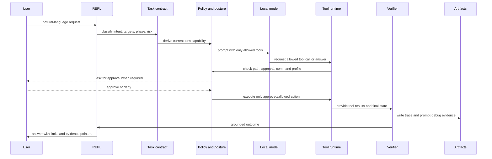
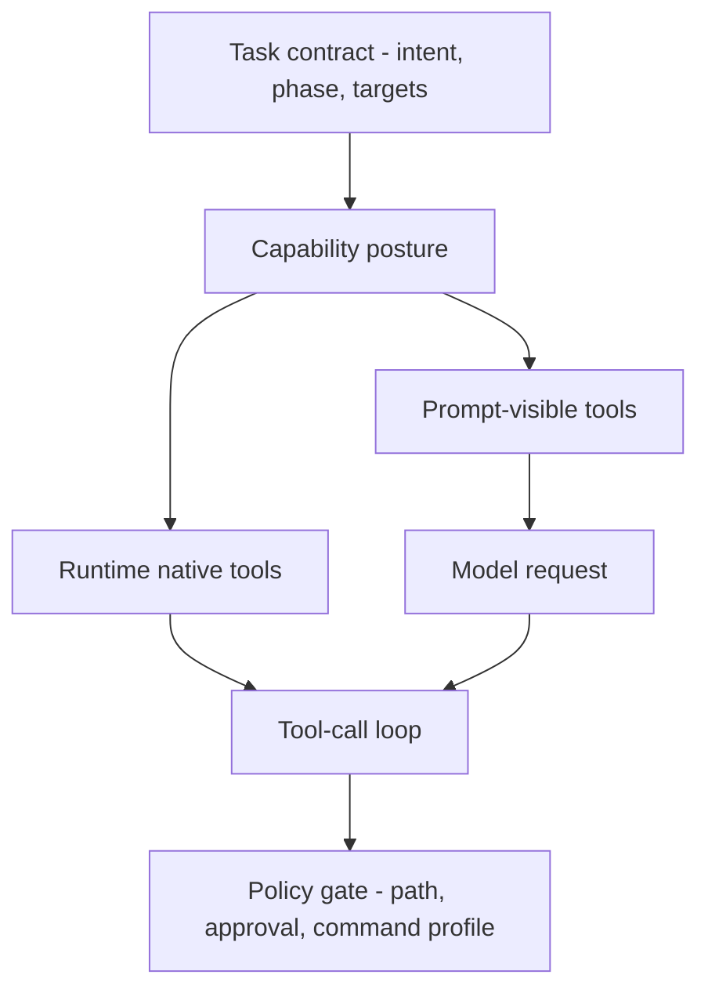
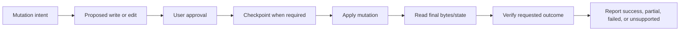

# Execution model

Each natural-language turn moves through a fixed pipeline. The exact class names change over time, but the ownership boundaries should stay stable: classification and policy decide what is allowed; tools perform bounded work; verification decides what can be claimed.

## Turn Pipeline

## Modes And Capability Posture

Public modes are intentionally small:

| Mode | User expectation | Runtime posture |
|---|---|---|
| `auto` | route to the right behavior | chooses a route, then applies the matching posture |
| `ask` | answer or inspect without changes | read-only; no mutation tools; no command execution |
| `plan` | produce an implementation plan | read-only planning; may inspect where policy allows |
| `agent` | perform workspace work | edit-capable with approval and verification |

Legacy names such as `dev`, `chat`, and `unified` are compatibility aliases for `agent`. They should not appear as the main public mode surface.

## Tool Surface Rule

The prompt-visible tool list and runtime-accepted tool list must agree. If a turn is read-only, the model should not see mutation tools and the runtime should reject mutation attempts anyway. This double boundary matters because prompt wording is not security.

## Approval, Checkpoint, Verification

Mutation is not one event. It is a controlled sequence:

Failure at any step should produce an honest failure or partial result. A denied approval is not a policy failure. A model that fails to call a required tool is not evidence that work was done. A verifier failure is not a success with a warning.

## Command Execution

Command execution is deliberately narrower than a shell. Talos should expose `run_command` only when the turn and configured profile allow it. Approval is the last gate, not the only gate: a command outside the visible profile should be rejected before it becomes a user approval question.

Command output may be useful evidence, but it is also model context. Redaction and high-entropy output handling reduce exposure; they do not prove complete secret or PII detection.

## Trace And Prompt Debug

Trace and prompt-debug artifacts exist to answer three questions:

1. What mode, posture, and tool surface did this turn use?
2. What did the model ask the runtime to do?
3. What evidence supports the final answer?

These artifacts are local evidence, not tamper-evident records. They are for debugging, audit, and release QA.
