# Architecture overview

Talos is a local-first CLI assistant for developer workspaces. The architecture is built around one rule: model output is never enough evidence by itself. A turn is useful only when policy, tools, approvals, verification, and trace records agree with the final claim.

Talos is not designed as an unbounded background agent. It is a bounded execution harness:

- classify the user request before selecting tools
- expose only tools that match the current mode and task posture
- keep filesystem operations inside the workspace boundary
- ask before mutation and bounded command execution
- checkpoint risky writes when policy requires rollback support
- verify the final state before claiming success
- preserve trace and prompt-debug evidence for review

## System Shape

```mermaid
flowchart LR
    User["User / terminal"] --> CLI["CLI commands and REPL"]
    CLI --> Mode["Mode controller - auto, ask, plan, agent"]
    Mode --> Contract["Task contract resolver - intent, targets, risk, phase"]
    Contract --> Surface["Capability posture - visible tool surface"]
    Surface --> Prompt["Prompt builder - current-turn contract"]
    Prompt --> Model["Local model backend - managed llama.cpp or configured engine"]
    Model --> Loop["Tool-call loop"]
    Loop --> Policy["Runtime policy gates"]
    Policy --> Tools["Workspace tools - read, grep, edit, command, batch"]
    Tools --> Verify["Verification and outcome classifier"]
    Verify --> Trace["Trace, prompt-debug, artifacts"]
    Trace --> Answer["Final answer"]
```

The important separation is between model suggestion and runtime authority. The model may ask for a tool call, but runtime policy decides whether that tool is available, whether approval is required, whether the path is allowed, and whether the result supports the final answer.

## Main Components

| Layer | Owns | Must not own |
|---|---|---|
| CLI and REPL | parsing commands, rendering prompts, interactive approval UI, setup and status commands | trust decisions hidden in display code |
| Mode controller | public modes, legacy aliases, read-only versus agentic posture | independent tool policy |
| Task contract | request intent, likely targets, phase, risk flags | final success claims |
| Capability posture | native tool visibility and prompt-visible tool description | path containment or command execution |
| Runtime policy | approval requirement, command-profile availability, protected read handling, failure classification | user-facing marketing claims |
| Workspace tools | bounded filesystem and command operations | bypassing policy because the model requested it |
| Verification | file-state checks, static-web checks, command/result evidence, outcome truthfulness | pretending unsupported evidence exists |
| Trace/artifacts | local audit records, prompt-debug captures, provider bodies where enabled | integrity-guaranteed ledger claims |

## Evidence Model

The final answer is the least trusted artifact. Reviewers should prefer evidence in this order:

1. final workspace state
2. command output and verifier output
3. tool result and execution trace
4. approval or denial records
5. prompt-debug and tool-surface evidence
6. provider-body and server logs when captured
7. final assistant prose

Talos is strongest for file-mutation turns because the runtime can compare the approved intent, actual bytes, readback, verifier output, and final answer. Read and command-output claims are bounded by the evidence the turn actually collected.

## What The Architecture Optimizes For

Talos optimizes for:

- local execution with explicit user control
- small, reviewable workspace changes
- deterministic policy where possible
- honest unsupported and failed outcomes
- release evidence that can be reproduced from a named commit

It deliberately avoids:

- model-owned free loops
- silent background mutation
- broad shell automation
- hidden cloud handoff
- unsupported claims about image/OCR, PowerPoint, or sensitive paperwork safety
