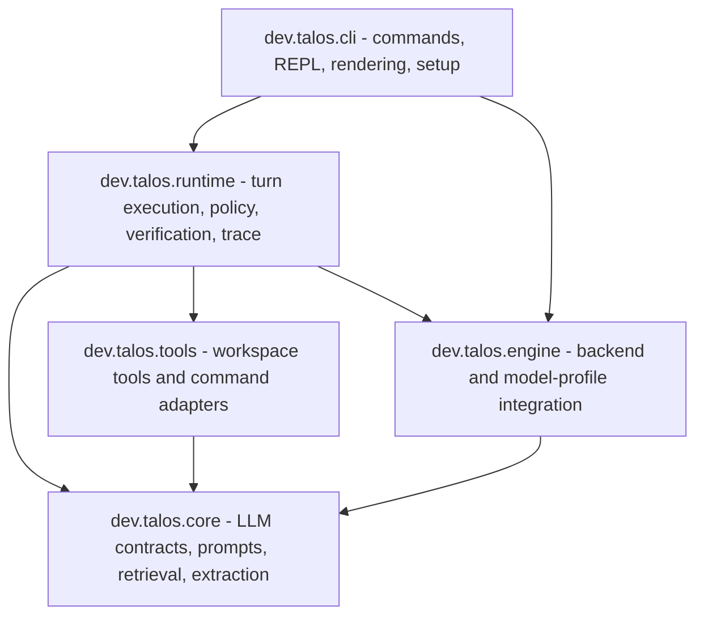
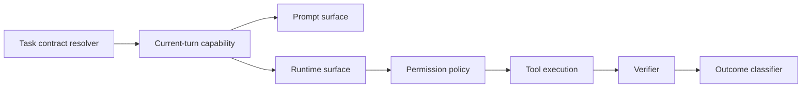

# Package map

This map is for orientation. It is not a generated dependency graph, but it names the ownership boundaries that should be preserved during refactors.

## Package Responsibilities

| Package | Responsibility | Typical classes or areas |
|---|---|---|
| `dev.talos.cli` | user-facing commands, REPL loop, mode selection, setup, status, rendering | command classes, mode handlers, prompt-debug commands, terminal UI |
| `dev.talos.core` | model contracts, prompt construction, retrieval, document extraction, shared core types | LLM client abstractions, prompt builders, index/retrieval, extraction adapters |
| `dev.talos.runtime` | turn execution, policy, tool-call loop, evidence handling, verification, outcome classification | tool-loop orchestration, permission policy, evidence obligations, trace capture |
| `dev.talos.tools` | bounded local operations | read, grep, edit, batch workspace mutation, command profile execution |
| `dev.talos.engine` | backend-specific startup and model profile integration | managed llama.cpp, profile catalog, health checks, backend capability discovery |

## Ownership Rules

- CLI rendering may explain a decision, but it should not make the trust decision.
- Prompt construction may describe allowed tools, but it should not authorize tools independently of runtime posture.
- Workspace tools must assume path and approval policy can fail closed.
- Engine code should report backend capabilities; it should not broaden product claims.
- Verification should inspect final state and evidence, not infer success from assistant prose.

## Refactor Pressure Points

Talos should continue moving policy out of large orchestrators and into named components. The target shape is:

The key invariant is single-source capability derivation: prompt-visible tools and runtime-accepted tools should come from the same current-turn capability, so Ask and Plan cannot drift into write-capable wording or behavior.
