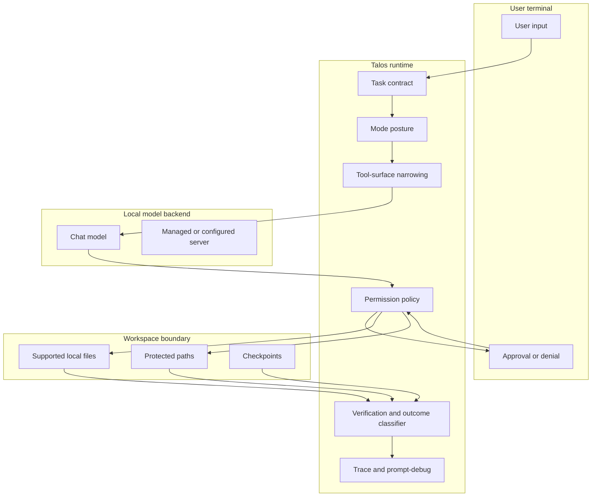

# Trust boundaries

Talos treats the model as an untrusted planner. The runtime owns authority. Trust boundaries are therefore implemented as concrete checks around paths, tools, approvals, commands, artifacts, and final claims.

## Boundary Map

## Boundary Table

| Boundary | What it protects | Primary failure it prevents |
|---|---|---|
| Workspace containment | reads, writes, deletes, checkpoints, batch operations | path escape through aliases, junctions, or sibling-prefix confusion |
| Protected-path classification | `.env`, credentials, SSH keys, package tokens, local private material | accidental protected read or protected-content handoff |
| Mode and posture narrowing | Ask and Plan read-only behavior | model sees or uses tools the current mode should not expose |
| Approval gate | mutation and bounded command execution | unapproved local changes or command execution |
| Command profiles | shell-adjacent behavior | arbitrary command execution through a general prompt |
| Checkpoints | rollback for risky mutation lanes | approved write leaves no recovery path where policy required one |
| Verification | outcome truthfulness | final answer claims success without matching file or command evidence |
| Runtime artifacts | auditability | no way to inspect what the turn actually did |

## Protected Reads

Protected reads are different from normal workspace reads. A direct approved protected read may enter model context in default developer behavior. In private mode, approved protected reads should stay local-display-only unless explicit send-to-model scope is enabled.

Indirect retrieval is a separate path. Grep, retrieval snippets, and RAG indexes must not become a way to smuggle protected content into context.

## Artifact And Redaction Limits

Secret redaction is best-effort. It covers common key-value secret shapes, known token forms, PEM private-key blocks, JWT-like tokens, AWS access-key shapes, and URL userinfo patterns in the sinks that use the redaction pipeline. This is not complete secret, credential, or PII detection.

run_command stdout and stderr pass through the model-context handoff boundary when command output is needed for verification. High-entropy streams and recognized secret shapes may be withheld or summarized before model handoff, but this is not a complete command-output privacy proof.

Local traces and logs are durable evidence artifacts, but they are not tamper-evident. A reviewer should treat them as useful local records, not cryptographic proof.

## Remote Endpoint Boundary

Chat model endpoints are localhost-gated by default. Non-localhost chat endpoints are rejected unless the backend configuration explicitly allows remote use. If remote chat is explicitly allowed, prompts can leave the machine.

## File Format Boundary

Talos beta is strongest on text-oriented developer workspaces. PDF, DOCX, and workbook support is extraction-oriented. Scanned PDFs, layout-perfect document understanding, tracked changes, embedded objects, charts, macros, and formula recalculation remain limited. Image/OCR and PowerPoint are outside the beta product claim.
