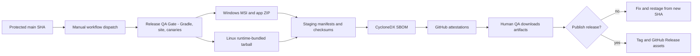

# Release process

The current public release lane is deliberate and manual.

## Branch Policy

- `v0.9.0-beta-dev` is the beta integration branch.
- `main` is protected.
- Verify protection with:

Policy: main is protected.

```bash
gh api repos/ai21z/talos-assistant/branches/main/protection
```

Required checks include Gradle check (Java 21) and Linux command portability smoke (Java 21).

## Staging Workflow

Release staging uses `.github/workflows/release-staging.yml`.

It is manually dispatched with `workflow_dispatch`, `target_sha`, and `version`. The `target_sha` must match the workflow ref SHA; staging rejects dual-SHA provenance because GitHub attestations bind to the workflow source identity. In the release contract wording: target_sha must match the workflow ref SHA.

No tag, push, pull-request, or release event may publish public artifacts.



QA staging artifact names:

- `qa-staging-talos-<version>-windows-x64`
- `qa-staging-talos-<version>-linux-x64`

These are not a GitHub Release asset. No draft GitHub Release asset is allowed before QA accepts the candidate.

The Release QA Gate owns behavioral readiness. It requires automated checks, installed-product smoke, manual PTY evidence, model evidence for the release scope, artifact canary scanning where runtime artifacts exist, and named exclusions for anything skipped.

## Public Artifact Targets

Windows x64:

```powershell
iwr https://github.com/ai21z/talos-assistant/releases/download/v0.10.8/install-talos.ps1 -OutFile install-talos.ps1
powershell -ExecutionPolicy Bypass -File .\install-talos.ps1 -Version 0.10.8 -Force -AllowUnsigned
```

The Windows 0.10.8 developer-beta assets are unsigned, so `-AllowUnsigned` is required for this release. Winget is not live yet. The planned Windows package ID is `TalosLocal.Talos`, the searchable package name or moniker is `talos-cli`, and the publisher is Aris Zounarakis. Do not advertise winget until the MSI is signed, the manifest is accepted, and `winget search --id TalosLocal.Talos -e` finds the package.

The packaged beta artifacts include a bundled Java runtime. They install Talos only. They do not bundle a llama.cpp server or model weights. Model setup remains an explicit post-install command through `talos setup models`.

Ubuntu/WSL x64:

```text
talos-<version>-linux-x64-app.tar.gz
install-talos.sh
```

The first Linux lane is Ubuntu/WSL x64 and runtime-bundled. It has no DEB/RPM/Homebrew/SDKMAN package claim.

Both public install lanes include a bundled Java runtime. They do not bundle a llama.cpp server or model weights. After install, users run `talos setup wizard` on Ubuntu/WSL or `talos setup models` on Windows.

Linux source/developer setup remains available from a checkout for contributors and local QA.

GitHub Release is the canonical artifact host. WiX is the Windows MSI builder prerequisite.

## Metadata Boundaries

Checksums prove that downloaded bytes match the published checksum manifest.

The SBOM is a CycloneDX dependency inventory.

Artifact attestations bind staged files to a GitHub Actions workflow run.

None of these metadata artifacts prove Talos behavior is correct. Behavioral confidence comes from the Release QA Gate and installed-product evidence.

Reviewers verify staged attestations with:

```bash
gh attestation verify <artifact> --repo ai21z/talos-assistant --source-digest <attestationSourceRepositoryDigest>
gh attestation verify talos-<version>-sbom.cdx.json --repo ai21z/talos-assistant --predicate-type https://cyclonedx.org/bom --source-digest <attestationSourceRepositoryDigest>
```

Use the manifest field `attestationSourceRepositoryDigest` for `--source-digest`.
