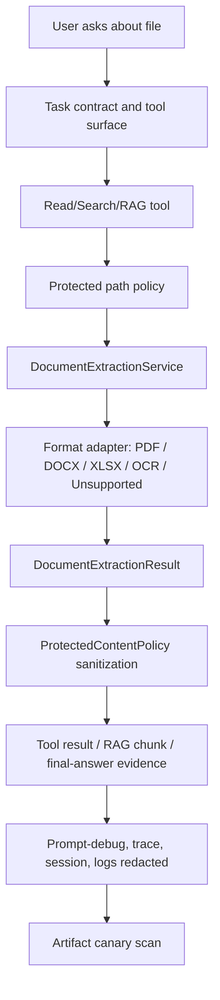

# Document Extraction Architecture Strategy

Date: 2026-05-16

Branch: `v0.9.0-beta-dev`

Status: superseded by implementation evidence in `full-talos-capability-state-and-document-extraction-audit.md`.

2026-05-16 update: the central extraction spine described here has now been
implemented for PDF text, DOCX text, and XLS/XLSX visible-cell text in the
beta-core scope. A configured OCR command path exists, but images/OCR and
PowerPoint are frozen out of beta and remain v1/open work. This document
remains useful as design rationale, but the current state is the full
capability audit report.

## 1. Strongest conclusion

Do not add PDF, Word, Excel, and image support as individual patches inside `ReadFileTool`, `GrepTool`, or `Indexer`.

Talos already has the right kind of runtime skeleton: tool registry, protected-content policy, protected-read scope, final-answer truthfulness shaping, RAG metadata, e2e harness, and artifact scanning. The correct strategy is to add a central document extraction spine and route every consumer through it.

The hard correction after re-review: "central extraction service" is not enough by itself. The service must define exact result types, failure states, provenance, limits, privacy states, cache/invalidation behavior, and caller contracts. Without those contracts, the service becomes a dumping ground and the same fragmentation returns under a better name.

## 2. Code strengths to reuse

| Strength | Code evidence | How to reuse |
|---|---|---|
| Central content redaction | `ProtectedContentPolicy.sanitizeText(...)`, `sanitizeToolResult(...)` | All extracted text must pass through this before model/artifact use. |
| Protected path policy | `ProtectedPathPolicy` and `ProtectedReadScopePolicy` | Extraction must preserve developer/private mode differences. |
| Tool result handoff boundary | `ToolCallExecutionStage` and `ToolCallSupport` | Extraction is tool output and must be sanitized before model-loop messages. |
| RAG/index metadata | `Indexer.writePolicyMetadata(...)` | Add extraction policy and adapter versions to force rebuilds. |
| Context packing and citations | `ContextPacker` and chunk metadata | Add page/sheet/cell/image provenance to extracted chunks. |
| Artifact scan | `ArtifactCanaryScanner` and `checkRuntimeArtifactCanaries` | Extend live-audit scan roots to extraction outputs. |
| Scripted e2e harness | `src/e2eTest/java/dev/talos/harness` | Add BDD-style extraction scenarios before live model audit. |
| Unsupported-format truthfulness | `FileCapabilityPolicy`, `UnsupportedDocumentFormats`, `AssistantTurnExecutor` | Keep honest refusal until each adapter is implemented and tested. |

The biggest strength is not parser-related. It is Talos's existing execution harness: policy -> tool surface -> approval -> tool result -> sanitizer -> trace/debug/session. Extraction must plug into that harness instead of bypassing it.

## 3. Weak points to strengthen first

| Weak point | Evidence | Ticket |
|---|---|---|
| Extraction has no central service | `ParserUtil` only handles text and blocks unsupported formats. | T290 |
| PDF missing | PDF classified unsupported. | T291 |
| Word missing | DOC/DOCX classified unsupported. | T292 |
| Excel semantics incomplete | XLS/XLSX visible-cell extraction exists, but charts, macros, password protection, `.xlsm`/`.xlsb`, and deep formula semantics remain out of scope. | T293 |
| Image OCR missing | Image formats classified unsupported. | T294 |
| Extraction privacy not yet proven | Existing privacy tests do not include extracted document content. | T295 |
| RAG extraction path not designed | Indexer currently parses text files directly. | T296 |
| `/reindex` private-mode bypass | `ReindexCommand` calls `Indexer` directly. | T298 |
| Static web live failure | Both models failed the `script.js` fix. | T297 |
| Independent fixture depth incomplete | Current live audit uses generated valid PDF/DOCX/XLSX fixtures and a controlled OCR stub. Checked-in canonical PDF/DOCX/XLSX fixtures now exist, but protected/adversarial real-world fixtures and real-OCR evidence remain missing. | T299 |
| Dependency/performance limits undefined | No extraction config or parser limits exist. | T300 |
| Docs must evolve with capabilities | Current docs correctly forbid claims but some reports are stale. | T301 |
| PPT deferred | PPT unsupported and not beta-required. | T302 |
| Format policy state machine still maturing | `FileCapabilityPolicy` now has extractable/deferred states for current beta-core formats, but dynamic outcomes such as encrypted, OCR-required, corrupt, truncated, and adapter-missing still need disciplined reporting across every tool surface. | T303 |
| Repeated extraction can be slow/stale | No extraction cache/invalidation design exists. | T304 |

## 4. Proposed architecture

Key rule: raw parser output is not a stable application type. It must be converted immediately into a structured extraction result with status, warnings, provenance, and sanitized text.

Contract rule: public extraction results should expose safe text and metadata. Raw parser output should be package-private or otherwise non-serializable and must not be stored in generic maps, Jackson-serializable records, logs, traces, or session objects.

Dependency recommendation after source review:

- Use direct, narrow adapters for beta: PDFBox for PDF, Apache POI for DOCX/XLSX, and a local Tesseract command adapter for OCR.
- Do not use Apache Tika as the first beta extraction layer. Tika is valuable, but it is deliberately broad: Office, PDF, archives, images, metadata, and optional OCR. That breadth is a liability until Talos has strict format-state policy, archive recursion denial, extraction result contracts, and artifact tests.
- Keep Tika as a later compatibility layer or detection helper only after the narrow adapters pass.

## 5. Ticket list

- T290: Document extraction architecture spine.
- T291: Local PDF text extraction.
- T292: Local Word DOCX extraction.
- T293: Local Excel XLSX extraction.
- T294: Local image OCR extraction.
- T295: Extraction privacy and artifact boundary.
- T296: Extraction RAG index integration.
- T297: Static web edit reliability before beta.
- T298: Private mode reindex policy gate.
- T299: Document extraction fixtures, BDD, and live audit.
- T300: Extraction dependencies, performance, and resource limits.
- T301: Document capability docs and release claims.
- T302: PowerPoint extraction deferred to full release.
- T303: File capability policy V3 extraction state machine.
- T304: Extraction cache and invalidation.

## 6. Recommended implementation order

1. Fix T298 private-mode `/reindex`.
2. Fix T297 static web edit reliability.
3. Implement T303 file capability policy states and config gates.
4. Implement T290 extraction spine without enabling any new format.
5. Implement T300 dependency/performance/resource limits.
6. Implement T295 extraction privacy/artifact tests.
7. Implement T299 valid fixtures and BDD harness.
8. Implement T296 extraction-aware RAG/index plumbing before broad adapter rollout.
9. Implement T291 PDF.
10. Implement T292 DOCX.
11. Implement T293 XLSX.
12. Implement T294 image OCR.
13. Implement T304 extraction cache/invalidation if repeated read/search/index cost is unacceptable after first adapters.
14. Update T301 docs and release reports.
15. Re-run deterministic tests, artifact scan, and two-model live audit.

Reason for this order: fix current runtime trust and edit gaps before adding document text. Then define the capability state machine, extraction boundary, limits, privacy, fixtures, and indexing contract before format adapters. This keeps SOLID boundaries and prevents parser-specific code from leaking into tools.

## 7. Testing strategy

Use TDD for each adapter:

1. write failing adapter fixture test
2. implement minimal adapter
3. add privacy/redaction test
4. add tool integration test
5. add RAG/index test
6. add e2e scenario
7. add live prompt-bank prompt
8. run artifact canary scan

Use BDD when validating user workflows:

- "Given a known PDF, when the user asks for a summary, then Talos cites extracted text and states limitations."
- "Given private mode and a protected DOCX, when approved local-display-only, then raw text is not sent to model context."
- "Given an OCR image with no text, when asked to summarize, then Talos says no OCR text was extracted and does not describe visual content."
- "Given a private-mode workspace, when `/reindex` is run with private RAG disabled, then Talos refuses before indexing."
- "Given a spreadsheet with formulas and hidden sheets, when extracted, then Talos reports formula/cached-value policy and hidden-sheet warnings."

## 8. Review against SOLID/design concerns

- Single responsibility: extraction adapters parse; tools orchestrate; policies sanitize; RAG indexes; answer shaping reports.
- Open/closed: adding PPT later should add an adapter, not modify every caller.
- Liskov/interface stability: every adapter returns the same `DocumentExtractionResult` contract.
- Interface segregation: OCR-specific dependency checks should not pollute PDF/DOCX/XLSX adapters.
- Dependency inversion: tools depend on extraction interface, not PDFBox/POI/Tesseract directly.
- Fail-fast contracts: unsupported, encrypted, OCR-required, partial, limit-exceeded, and parser-failed are first-class statuses, not ad hoc strings.
- Performance discipline: large files, OCR, spreadsheets, and indexes are bounded by config and tests before feature claims are allowed.

## 9. Release claim discipline

Until these tickets are implemented and audited, Talos still cannot claim:

- PDF reader
- Word reader
- Excel reader
- image/scanned document reader
- private paperwork readiness
- reliable static web repair
- global guarantee that protected content never reaches model context
- image understanding beyond OCR text
- spreadsheet formula recalculation
- valid PDF/Office file creation or editing

After the tickets pass, allowed claims should still be narrow:

- local text extraction for supported document types
- explicit privacy mode
- redacted artifacts by default
- tested extraction limitations
- audited local behavior, not general legal/tax/health correctness
