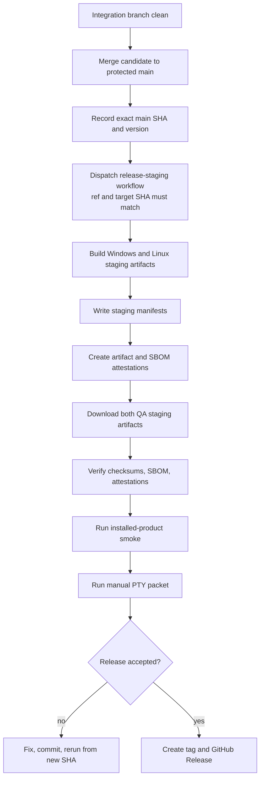

# Release Candidate Runbook

The Release QA Gate blocks public artifact publication until evidence matches the candidate SHA. A successful build is not a release decision.

No GitHub Release asset may be created before QA accepts the candidate. Local staging artifacts may be used for early smoke. CI staging artifacts are review inputs for publication. Neither is a public release artifact.

## Candidate Flow



## Pre-Staging Checklist

1. Inventory all current Gradle tasks and CI jobs relevant to the candidate.
2. Confirm branch, commit SHA, and candidate version.
3. Confirm the worktree is clean.
4. Run the full automated gate.
5. Run the maintainer quality packet:

   ```powershell
   .\gradlew.bat releaseQualityPacket --no-daemon
   ```

6. Confirm site tests and deploy-surface leak checks pass when site content changed.
7. Confirm no public docs claim an artifact exists before it is published.
8. Confirm the release workflow is manual-only for publication.

## Staging Verification

After the workflow finishes, download both QA staging artifacts and verify:

- manifest `targetSha`, checkout SHA, and attestation source digest match the candidate SHA
- checksums match every staged file
- SBOM parses as CycloneDX JSON
- artifact attestations verify against the recorded source digest
- Windows app ZIP contains the expected JVM options
- Linux installed smoke has no native-access launcher warning

## Manual Evidence

Run installed-product smoke before publication:

- `talos --version`
- `talos status --verbose`
- `talos doctor --start`
- REPL `/status --verbose`
- REPL `/mode`
- REPL `/prompt`
- REPL `/last trace`

Run the manual PTY transcript packet for at least one real mutation lane. If the release claim depends on model behavior, run the two-model large-scale live audit using the standard profiles.

Generated Markdown quality reports under `reports/` are reviewer snapshots. They are useful, but the release decision should be anchored to the JSON summaries, `qualityReportGate`, staged artifacts, manual PTY evidence, and CI run IDs.

## Failure Rule

If staging evidence fails, do not repair evidence in place. Fix the product or process, commit the fix, and stage again from the new SHA.
