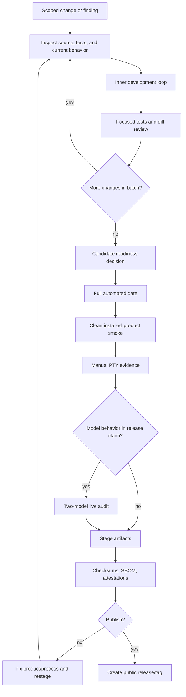

# Work-Test Cycle

Talos work uses two loops: an inner development loop for small changes and a Release QA Gate for candidate evidence. Do not mix them. A focused unit test is enough for a small implementation step; it is not enough to publish artifacts. A full release packet is necessary before public artifacts; it is too heavy for every edit.

## Loop Map

## Inner Development Loop

Use this while actively implementing or debugging:

1. confirm branch, version, and worktree state
2. inspect the affected source and tests
3. add or update focused regression coverage when behavior changes
4. implement the smallest coherent fix
5. run the focused test
6. run `git diff --check`
7. review the diff before widening scope

Use the full Gradle `check` when the change touches runtime behavior, release wiring, public docs contracts, or shared policy. Do not bump the patch version for every inner-loop change.

## Release QA Gate

Release decisions require evidence that belongs to the exact candidate SHA. Stale local builds, dirty-tree runs, or old installed binaries are stabilization evidence only.

Artifact taxonomy:

| Artifact type | Meaning | Public? |
|---|---|---|
| Local staging artifact | built locally for developer smoke and inspection | no |
| CI staging artifact | built by release staging workflow for QA review | no |
| Public release artifact | attached to a GitHub Release or otherwise advertised as installable | yes |
| Draft release asset | a GitHub Release asset attached before publication; a draft GitHub Release asset is not safe pre-QA evidence | treated as public for safety |

Before publication, require:

- full automated gates for the candidate
- clean installed-product smoke from the candidate artifact
- manual PTY transcript for real terminal behavior
- large-scale live audit when model behavior is part of the release claim
- runtime artifact canary scan for manual evidence roots when artifacts exist
- checksum, SBOM, and attestation verification for staged artifacts
- named exclusions for any skipped release gate

Do not publish release assets from stale, dirty, or unreviewed evidence.

## Evidence Quality

Evidence must name:

- branch and commit SHA
- candidate version
- executable actually invoked
- installed path or artifact path
- backend and model profile
- workspace root
- Talos home when isolated
- commands run and their result

For live audits, save prompt-debug and trace evidence after natural-language turns. For mutation lanes, save final file state and workspace diff. For release staging, verify the staged manifest and artifact checksums before treating the artifact as release-ready.
